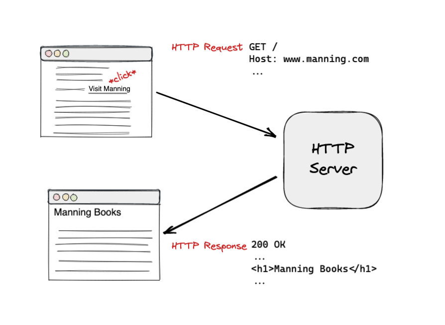

= Building Hypermedia Systems
:chapter: 1
:sectnums:
:figure-caption: Figure {chapter}.
:listing-caption: Listing {chapter}.
:table-caption: Table {chapter}.
:sectnumoffset: 0
// line above:  :sectnumoffset: 0  (chapter# minus 1)
:leveloffset: 1
:sourcedir: ../code/src
:source-language:

= Reintroducing Hypermedia

This chapter covers

* An introduction to the core concepts of hypermedia
* Why you might choose hypermedia over other approaches
* How hypermedia can be used to build modern web applications

Hypermedia is a universal technology today, nearly as common as electricity.  Billions of people use a hypermedia-based
systems every day, mainly by interacting with the _HyperText Markup Language (HTML)_  being exchanged via the _HyperText Transfer
Protocol (HTTP)_ by using a Web Browser connected to the World Wide Web.  People use these systems to get their news, check in on friends,
buy things online, play games, send emails and so forth: the variety and sheer number of online services is truly
astonishing.

And yet, despite this ubiquity, hypermedia itself is a strangely under-explored concept, left mainly to specialists.  Yes,
you can find a lot of tutorials on how to author HTML, create links and forms, etc.  But it is rare to see a discussion
of HTML __as a hypermedia__.  This is in sharp contrast with the early web development era, when concepts like
_Representational State Transfer (REST)_ and _Hypermedia As The Engine of Application State (HATEOAS)_ were constantly
discussed and debated among developers.

It is sad to say, but in some circles today HTML is viewed resentfully: it is considered an awkward, legacy markup language
that must be used build user interfaces in what are primarily Javascript-based applications, simply because HTML happens to be
there, in the browser.

This as a shame, and we hope that with this book we can convince you that the hypermedia architecture is not simply a
piece of legacy technology that we have to begrudgingly deal with.  Instead, we aim to show you that it is a tremendously
innovative, simple and _flexible_ way to build robust distributed systems.  Not only that, but the hypermedia approach
deserves a seat at the table when you, a web developer, are considering what the architecture of your next online software
system will be.

== So, What Is Hypermedia?

[quote, Ted Nelson, https://archive.org/details/SelectedPapers1977/page/n7/mode/2up]
____
Hypertexts: new forms of writing, appearing on computer screens, that will branch or perform at the reader’s
command. A hypertext is a non-sequential piece of writing; only the computer display makes it practical.
____

Right.  So what is hypermedia?  Simply, it is a media, for example a text, that includes non-linear branching from one location
in the media to another, via, for example, hyperlinks embedded that the media.  The prefix "hyper-" derives from the Greek prefix
"ὑπερ-" which means "beyond" or "over", indicating that hypermedia _goes beyond_ normal, passively consumed media.  Things
like hyperlinks are _hypermedia controls_, that is, elements that allow the reader to control and interact with the hypermedia.

You are probably more familiar with the term _hypertext_, from whose Wikipedia page the above quote is taken.  Hypertext
is a sub-set of hypermedia and much of this book is going to discuss how to build modern web applications with HTML, the
HyperText Markup Language.

However, even when you build applications using HTML, there are nearly always other types of media involved: images,
videos and so forth.  Because of this, we prefer the term _hypermedia_ a more appropriate for discussing
applications built in this manner.  We will use the term hypermedia for most of this book in order to capture this more
general concept.

=== HTML

[quote, Rescuing REST From the API Winter, https://intercoolerjs.org/2016/01/18/rescuing-rest.html]
____
In the beginning was the hyperlink, and the hyperlink was with the web, and the hyperlink was the web.  And it was good.
____

In order to help us understand the more general concepts of hypermedia, it would be worthwhile to take a brief look at a
concrete and familiar example of the technology: HTML.

HTML is the most widely used hypermedia in existence, and this book naturally assumes that the reader has a reasonable familiarity
with it.  You do not need to be an HTML or CSS expert to understand the code in this book, but the better you understand the core
tags and concepts of HTML, the more you will get out of the book.

Now, let's consider the two defining hypermedia elements in HTML: the anchor tag (which produces a hyperlink) and
the form tag.

Here is a simple anchor tag:

[#listing-1-1, reftext={chapter}.{counter:listing}]
.A Simple Hyperlink
[source,html]
----
<a href="https://www.manning.com/">
  Manning Books
</a>
----

In a typical browser, this tag would be interpreted to mean: "Show the text 'Manning Books' in manner indicating that
it is clickable and, when the user clicks on that text, issue an HTTP GET to the url `https://www.manning.com/`.  Take the
resulting HTML content in the body of the response and use it to replace the entire screen in the browser as a new
document."

This is the main mechanism we use to navigate around the web today, and it is a canonical example of a hypermedia link,
or a hyperlink.

Here is what a user interaction with an anchor tag looks like in visual form:

[#figure-1-1, reftext="Figure {chapter}.{counter:figure}"]
.An HTTP GET In Action

You can see that the link initiates an HTTP `GET` request when it is clicked, which has some includes some data on
what, exactly, the browser wants from the server, and the server responds with more hypermedia content, that is, with
HTML.

So far, so good.  Now let's consider a simple form tag:

[#listing-1-2, reftext={chapter}.{counter:listing}]
.A Simple Form
[source,html]
----
<form action="/signup" method="post">
  <input type="text" name="email" placeholder="Enter Email To Sign Up..."/>
  <button>Sign Up</button>
</form>
----

This bit of HTML would be interpreted by the browser roughly as: "Show a text input and button to the user.  When the user submits
the form by clicking the button or hitting enter in the input, issue an HTTP POST request to the path '/signup' on the
site that served the current page.  Take the resulting HTML content in the response body and use it to replace the entire
screen in the browser."

I am omitting a few details and complications here: you also have the option of issuing an HTTP `GET` with forms, the
result may _redirect_ you to another URL and so on, but this is the crux of the form tag.

Here is what a form looks like in action:

[#figure-1-2, reftext="Figure {chapter}.{counter:figure}"]
.An HTTP POST In Action
image::../images/figure_1-1_http_mental_model_post.png[]

In this sequence of requests and responses, the form issues an HTTP `POST` to the server, gets a redirect response,
and then issues an HTTP `GET` request to the server for the final content.  This is a classic example of the Post/Redirect/Get
pattern, which we will discuss a bit later in the book.

I want you to keep these diagrams in your head as a mental model while you read the rest of this the book.  This is the
pattern that we are going to build on as we go along: exchanging _hypermedia_ with a server in response to user
events.

Now, as someone interested in web development, the above diagrams probably look very familiar to you, perhaps even boring.  But,
despite its familiarity, consider the fact that the two above mechanisms are really the _only_ native ways for a user
to interact with a server in plain HTML.  That's barely anything at all!  And yet, armed with only these two hypermedia
controls, the early web was able to grow exponentially and offer a staggeringly large amount of online, dynamic functionality
to an even more staggeringly large number of people!

This is strong evidence of the power of hypermedia.  Even today, in a web development world increasingly dominated by large
JavaScript-centric front end frameworks, many people choose to simply use vanilla HTML to achieve their goals and are
often perfectly happy with the results.

So with just these two little tags, hypermedia manages to pack a heck of a punch!

=== So What _Isn't_ Hypermedia?

So we've looked at the two ways to interact with a server via HTML.  Now let's consider another approach to
interacting with a server by issuing an HTTP request via JavaScript:

[#listing-1-3, reftext={chapter}.{counter:listing}]
.Javascript
[source,html]
----
<button onclick="fetch('/api/v1/contacts') <1>
                 .then(response => response.json()) <2>
                 .then(data => updateTable(data))"> <3>
    Fetch Contacts
</button>
----
<1> Issue the request
<2> Convert the response to a JavaScript object
<3> Invoke the `updateTable()` function with the object

Here we have a button element in HTML that executes some JavaScript when it is clicked.  That JavaScript will
issue an HTTP `GET` request to `/api/v1/contacts` using the `fetch()` API, a popular API for issuing an "Asynchronous JavaScript and XML",
or AJAX, requests.  An AJAX request is like a normal HTTP request in many ways, but it is issued "behind the scenes" by the
browser: the user does not see a request indicator like in normal links and forms, and it is up to the JavaScript code
that issues the request to deal with the response.

Despite AJAX having XML as part of its acronym, today the HTTP response to this request would almost certainly be in the
JavaScript Object Notation (JSON) format rather than XML.  (That is a long story!)

The HTTP response to this request might look something like this:

[#listing-1-3, reftext={chapter}.{counter:listing}]
.JSON
[source,json]
----
{ <1>
  "id": 42, <2>
  "email" : "json-example@example.org" <3>
}
----
<1> The start of a JSON object
<2> A property, in this case with the name `id` and the value `42`
<3> Another property, the email of the contact with this id

The JavaScript code above converts the JSON text received from the server into a JavaScript object, which is very easy
when using the JSON notation.  This object is then handed off to the `updateTable()` method.  The `updateTable()`
method would then update the UI based on the data that has been received from the server, perhaps appending this
contact information to an existing table or replacing some other content with it.  (We aren't going to show
this code because it isn't important for our discussion.)

What is important to understand about this server interaction is that it is _not_ using hypermedia.  The
JSON API being used here does not return a hypermedia-style response.  There are no _hyperlinks_ or other hypermedia-style
controls in it.  This is, rather, a _Data API_.  It is returning simple, Plain Old JSON(POJ) formatted data.  We say
 "POJ" here because, when XML was being used rather than JSON, the term for an API like this was "Plain Old XML", or
POX.  The term POX was disparaging at the time, sometimes called "The Swamp of POX", but, today, the POJ style of HTTP
API is ubiquitous.

Now, because the response is in POJ and is _not_ hypermedia, it is up to the code in the  `updateTable()` method to
understand how to turn this data into HTML.  The code in `updateTable()` needs to know about the internal structure of
this data, what the fields are named, how they relate to one another, how to update the data, and how to render this
data to the browser.  This last bit of functionality would typically be done via some sort of client-side templating
library that generates HTML in memory in the browser based on data passed into it.

Now, this bit of javascript, while very modest, is the beginnings of what has come to be called a Single Page
Application (SPA): in this case, the application is no longer navigating between pages using hypermedia controls like
anchor tags that interact with a server using hypermedia.  Instead, the application is exchanging _plain data_ with the
server and updating the content within a single page, hence "Single Page Applications".

Today, of course, the vast majority of Simple Page Applications adopt far more sophisticated frameworks for managing their
user interface than this simple example shows.  Libraries like React, Angular, Vue.js, etc. are all popular ways to manage
far more complex user interactions than our little demo.  With these more complex frameworks you will typically work with a
much more elaborate client-side model (that is, JavaScript objects stored locally in the browser's memory that represent
the "model" or "domain" of your application.)  You then update these JavaScript objects and allow the framework to "react" to
those changes via infrastructure baked into the framework itself, which will have the effect of updating the user
interface.  (This approach, while not new, popularized the term "Reactive Programming" in web development.)

At this point, if you adopt one of these popular libraries, you, the developer, rarely interact with hypermedia at all.
You may it to build your user interface, but the anchor tag's natural behavior is de-emphasized and forms become a
data collection mechanism.  Neither interact with the server in their native language of HTML, and rather become user
interface elements that drive local interactions with the in memory domain model, which is then synchronized with a
server via JSON APIs.

So, admittedly, modern SPAs are much more complex than what we have going on in the above example.  However, at the level
of a _network architecture_, these more sophisticated frameworks are essentially equivalent to our simple example: they
exchange Plain Old JSON with the server, rather than exchanging a hypermedia.

== Why Use Hypermedia?

[quote, Tom MacWright, https://macwright.com/2020/05/10/spa-fatigue.html]
____
The emerging norm for web development is to build a React single-page application, with server rendering. The two key
elements of this architecture are something like:

1. The main UI is built & updated in JavaScript using React or something similar.
2. The backend is an API that that application makes requests against.

This idea has really swept the internet. It started with a few major popular websites and has crept into corners like
marketing sites and blogs.
____

Tom is correct: JavaScript-based Single Page Applications have taken the web development world by storm, offering
a far more interactive and immersive experience than the old, gronky, web 1.0 HTML-based application could.  Some
SPAs are even able to rival native applications in their user experience and sophistication.

So, why on earth would you abandon this new, increasingly popular (just do a job search for reactjs!) approach for an
older and less discussed one like hypermedia?

Well, it turns out that, even in its original form, the hypermedia architecture has a number of advantages when compared with
the JSON/Data API approach:

* It is an extremely simple approach to building web applications
* It is extremely tolerant of content and API changes (in fact, it thrives on them!)
* It leverages tried and true features of web browsers, such as caching

As someone interested in web development, these advantages should sound appealing to you. The first two, in
particular, address two pain points in modern web development:

* Front end infrastructure has become extremely complex (sophisticated might be the nice way of saying it!)
* JSON API churn, that is, the constant changes made JSON APIs to support application needs, has become a huge pain for
  many application developers

Taken together, these two problems have become known as "Javascript Fatigue": a general sense of exhaustion with all the
hoops that are necessary to jump through to get anything done on the web.

And it's true: the hypermedia architecture _can_ help cure Javascript Fatigue.  But you may reasonably be wondering:
so, if hypermedia is so great and can address these problems so obvious in the web development industry, why has it has
been abandoned web developers today?  After all, web developers are a pretty smart lot.  Why wouldn't they use
this obvious, native web technology?

There are two related reasons for this somewhat strange state of affairs.  The first is this: the expressiveness of
hypermedia (and HTML in particular) hasn't changed much _since the late 1990s_, in terms of user interaction with
a server.  Sure, many new features have been added to HTML, but there haven't been _any_ new ways to interact with a
server via pure HTML added in over two decades! HTML developers still only have anchor tags and forms available as
hypermedia controls, and those hypermedia controls can still only issue `GET` and `POST` requests, despite the fact
that other types of HTTP requests have existed almost from the start!

This somewhat baffling lack of progress leads immediately to the second and more practical reason that hypermedia has
fallen on hard times: as the interactivity and expressiveness of HTML _as a hypermedia_ has remained frozen in time, the
web itself has marched on, demanding more and more interactive web applications.

JavaScript, coupled to data-oriented POJ APIs, has stepped in as a way to provide these new interactive features to end users.
It was the _user experience_ that you could achieve in JavaScript (and that you couldn't hope to achieve in HTML) that
drove the web development community over to the JavaScript-heavy Single Page Application approach.

This is unfortunate, and it didn't have to be this way.  There is nothing _intrinsic_ to the idea of hypermedia that
prevents a richer, more expressive interactivity model.  Rather than abandoning the hypermedia architecture, the industry
could have demanded more and more interactivity _within_ that original, hypermedia model of the web.  There is nothing
written in stone saying "only forms and anchor elements can interact with a server, and only in response to a few
user interactions."  JavaScript broke out of this model, why couldn't HTML have done the same?

There have been heroic efforts to continue to advance hypermedia outside of HTML, efforts like HyTime, VoiceXML, and HAL.
But HTML, the most widely used hypermedia in the world, stopped making progress as a hypermedia, and the web development
world moved on, solving the interactivity problem using other tools.

=== A Hypermedia Comeback?

So, for many developers today working in an industry dominated by JavaScript and SPA frameworks, hypermedia has become
an afterthought, if it is thought about at all.  You simply can't get the sort of modern interactivity out of HTML, the
hypermedia we all use day to day, necessary for today's modern web applications.

Those of us passionate about hypermedia and the web in general can sit around wishing that, instead of stalling as a
hypermedia, HTML had continued to develop, adding new mechanisms for exchanging hypermedia with servers and increasing
its general expressiveness.  That it was possible to build modern web applications within the original, hypermedia-oriented
and REST-ful model that made the early web so powerful, so flexible, so... fun!

In short that hypermedia could, once again, be a legitimate technical approach to consider when developing a new web
application.

Well, I have some good news.  In the last decade, a few idiosyncratic, alternative front end libraries have arisen that
attempt to do exactly this!  Somewhat ironically, these libraries are all written in JavaScript.  However, these libraries
use JavaScript not as a __replacement__ for the hypermedia architecture, but rather use it to augment HTML itself
_as a hypermedia_.

These _hypermedia-oriented_ libraries re-center the hypermedia approach as a viable choice for your next web application.

=== Hypermedia-Oriented Javascript Libraries

In the web development world today there is a debate going on between the SPAs approach and what are now being called
"Multi-Page Applications" or MPAs.  MPAs are usually just the old, traditional way of building web applications with
links and forms across multiple web pages and are thus, by their nature, hypermedia oriented.  They are clunky, but,
despite this clunkiness, some web developers have become so exasperated at the complexity of SPA applications they `have`
decided to go back to this older way of building things and just accept the limitations of plain HTML.

Some thought leaders in web development, such as Rich Harris, creator of svelte.js, a popular SPA library, propose a mix
of the MPA style and the SPA style.  Harris calls this approach to building web applications "transitional", in that
it attempts to mix both the older MPA approach and the newer SPA approach into a coherent whole, and so is somewhat
like the "transitional" trend in architecture, which blends traditional and modern architectural styles.  It's a
good term and a reasonable compromise between the two approaches to building web applications.

But it still feels a bit unsatisfactory.  Why have two very different architectural models _by default_?  Recall that the
crux of the tradeoffs between SPAs and MPAs is the _user experience_ or interactivity of the application.
This is typically the driving decision when choosing one approach versus the other for an application or, in the case
of Transitional Web Applications, for a particular feature.

It turns out that, by adopting a hypermedia oriented library, the interactivity gap closes dramatically between
the MPA and SPA approach.  You can stay in the simpler hypermedia model for much more of your application, perhaps
even all of it.  Rather than having an SPA with a bit of hypermedia around the edges, or an even mix of the two
dramatically different styles of web development, you can have a web application that is _primarily_ hypermedia driven,
only kicking out to the more complex SPA approach in the areas that demand it.  This can tremendously simplify your
web application and provide a much more coherent and understandable final product.

One such hypermedia oriented library is htmx, created by the authors of this book.  htmx will be the focus of much (but not all!)
of the remainder of this book, and we hope to show you that you can, in fact, create many common "modern" UI features in
a web application entirely within the hypermedia model.  Not only that, but it is refreshingly fun and simple to do so!

=== Hypermedia Driven Applications

When building a web application with htmx and other hypermedia oriented libraries the term Multi-Page Application applies
_roughly_, but it doesn't really capture the crux of the application architecture.  htmx, as you will see, does not need
to replace entire pages and, in fact, an htmx-based application can reside entirely within a single page.  (We don't
recommend this practice, but it is certainly possible!)

We rather like to emphasize the _hypermedia_ aspect of both the older MPA approach and the newer htmx-based approach.
Therefore, we use the term _Hypermedia Driven Applications (HDAs)_ to describe both.  This clarifies that the core distinction
between these approaches and the SPA approach _isn't_ the number of pages in the application, but rather the underlying
_network_ architecture.

So, what would the htmx and, let us say, the HDA equivalent of the JavaScript-based SPA-style button we discussed
above look like?

It might look something like this:

[#listing-1-4, reftext={chapter}.{counter:listing}]
.an htmx implementation
[source,html]
----
<button hx-get="/contacts" hx-target="#contact-table"> <1>
    Fetch Contacts
</button>
----
<1> issues a `GET` request to `/contacts`, replacing the `contact-table`

As with the JavaScript example, we can see that this button has been annotated with some attributes.  However, in this case
we do not have any imperative scripting going on.  Instead, we have _declarative_ attributes, much like the `href`
attribute on anchor tags and the `action` attribute on form tags.  The `hx-get` attribute tells htmx: "When the user
clicks this button, issue a `GET` request to `/contacts`".  The `hx-target` attribute tells htmx: "When the response
returns, take the resulting HTML and place it into the element with the id `contact-table`".

I want to emphasize here that the HTTP response from the server is expected to be in _HTML format_, not in JSON.  This means that
htmx is exchanging _hypermedia_ with the server, just like an anchor tag or form might, and thus the interaction is
still firmly within this original hypermedia  model of the web.  htmx _is_ adding browser functionality via JavaScript,
but that functionality is _augmenting_ HTML as a hypermedia, rather than _replacing_ the network model with a
data-oriented JSON API.

Despite perhaps looking superficially similar to one another, it turns out that this htmx example and the JavaScript-based
example are extremely different architectures and approaches to web development.  And, as we walk through building a
Hypermedia Driven Application in this book, the differences between the two approaches will become more and more
apparent.

This example may seem somewhat cute: this is a simple and a contrived JavaScript example that no one would ever write in
production code.   And this is a neat demo of a small library that perhaps makes HTML a bit more expressive, sure.

But maybe the htmx example doesn't look very convincing yet. Can this simple concept really scale up to the needs of
sophisticated, modern web applications?

In fact, for many applications, it can: just as the original web scaled up shockingly well via hypermedia, this approach
can go far further than a first glance suggests.  Despite its simplicity (or, perhaps, because of it) you will be
surprised just how far we can get in creating dynamic and interactive user experiences.

== REST

I don't think there is a more misunderstood term in all of software development than REST, which stands for REpresentational State
Transfer.  You have probably heard this term and, if I asked you which of the two examples, the simple JavaScript button
and the htmx-powered button, was REST-ful, there is a good chance you would say that the JavaScript button.  It is
hitting a JSON data API, and you probably only hear the term REST in the context of JSON APIs!  It turns out that this
is _exactly backwards_!

It is the _htmx-powered button_ that is REST-ful, by virtue of the fact that the interaction with the server is
driven by hypertext.

The industry has been using the term REST largely incorrectly for over a decade now.  Roy Fielding, who coined the term
REST (and who should know!) had this to say:

[quote, Roy Fielding, https://roy.gbiv.com/untangled/2008/rest-apis-must-be-hypertext-driven]
____
I am getting frustrated by the number of people calling any HTTP-based interface a REST API. Today’s example is the SocialSite REST API. That is RPC. It screams RPC. There is so much coupling on display that it should be given an X rating.

What needs to be done to make the REST architectural style clear on the notion that hypertext is a constraint? In other words, if the engine of application state (and hence the API) is not being driven by hypertext, then it cannot be RESTful and cannot be a REST API. Period. Is there some broken manual somewhere that needs to be fixed?
____

We will go into the details of how this happened in a future chapter where we do a deep dive in the famous Chapter 5 of
Fielding's PhD dissertation, but for now let me summarize what I view as the crucial practical difference between the
two buttons:

In the case of the JavaScript powered button, the client (that is, the JavaScript code) _must understand what a contact
is_.  It needs to know the internals of the data representation, what is stored where, how to update the data, etc.

In contrast, the htmx-powered button has no knowledge of what a contact it.  It simply issues an HTTP request and swaps
the resulting HTML into the document.  The HTML can change dramatically, introducing or removing all sorts of content and
the htmx-button will happly continue exchanging hypermedia with the server.  Try changing the content returned by the
JSON API example and see what happens!

This is part of what is called the _Uniform Interface_ of REST, and it is the crucial aspect of the hypermedia network
architecture that makes it so flexible.  Again, we'll talk more about this later, but I wanted to give you a quick
peak into _why_ hypermedia is so flexible and, I hope, pique your interest in the technical details of the approach
for later on in the book.

== When should You Use Hypermedia?

Even if you decide not to use something like htmx and just accept the limitations of plain HTML, there are times when it,
and the hypermedia architecture, is worth considering for your project:

Perhaps you are building a web application that simply doesn't _need_ a huge amount of user-experience innovation.  These are
very common and there is no shame in that!  Perhaps your application adds its value on the server side, by coordinating
users or by applying sophisticated data analysis.  Perhaps your application adds value by simply sitting in front of a
well-designed database, with simple Create-Read-Update-Delete (CRUD) operations.  Again, there is no shame in this!

In any of these cases, using a hypermedia approach would likely be a great choice: the interactivity needs of
these applications are not dramatic, and much of the value of the applications live on the server side, rather on
than on the client side.  They are all amenable to what Roy Fielding, one of the original engineers who worked on the
web, called "large-grain hypermedia data transfers": you can simply use anchor tags and forms, with responses that
return entire HTML documents from requests, and things will work fine.  This is exactly what the web was designed to do.

By adopting the hypermedia approach for these applications, you will save yourself a huge amount of client-side complexity
that comes with adopting the Single Page Application approach: there is no need for client-side routing, for managing
a client side model, for hand-wiring in JavaScript logic, and so forth.  The back button will "just work".  Deep linking
will "just work".  You will be able to focus your efforts on your server, where your application is actually adding value.

Now, by layering htmx or another hypermedia-oriented library on top of this approach, you can address many of the usability
issues that come with it by taking advantage of finer-grained hypermedia transfers.  This opens up a whole slew of new
user interface and experience possibilities.  But more on that later.

== When shouldn't You Use Hypermedia?

That all being said, and as admitted hypermedia partisans, there are, of course, cases where hypermedia is not the right
choice.  What would a good example be of such an application?

One example that springs immediately to mind is an online spreadsheet application, where updating one cell could have a large
number of cascading changes that need to be made on every keystroke.  In this case, we have a highly inter-dependent
user interface without clear boundaries as to what might need to be updated given a particular change.  Introducing a server
round-trip on every cell change would bog performance down terribly!  This is simply not a situation
amenable to that "large-grain hypermedia data transfer" approach.  For an application like this we would certainly look
into a sophisticated client-side JavaScript approach.

_However_, perhaps this online spreadsheet application also has a settings page.  And perhaps that settings page _is_ amenable to
the hypermedia approach.  If it is simply a set of relatively straight-forward forms that need to be persisted to the
server, the chances are good that hypermedia would, in fact, work great for this part of the app.

And, by adopting hypermedia for that part of your application, you might be able to simplify that part of the application
quite a bit. You could then save more of your application's _complexity budget_ for the core, complicated spreadsheet logic,
keeping the simple stuff simple.  Why waste all the complexity associated with a heavy JavaScript framework on something
as simple as a settings page?

.What Is A Complexity Budget?
****
Any software project has a complexity budget, explicit or not: there is only so much complexity a given development
team can tolerate and every new feature and implementation choice adds at least a bit more to the overall complexity
of the system.

What is particularly nasty about complexity is that it appears to grow exponentially: one day you can keep the entire
system in your head and understand the ramifications of a particular change, and a week later the whole system seems
intractable.  Even worse, efforts to help control complexity, such as introducing abstractions or infrastructure to
manage the complexity, often end up making things even more complex.  Truly, the job of the good software engineer
is to keep complexity under control.

The surefire way to keep complexity down is also the hardest: say no.  Pushing back on feature requests is an art
and, if you can learn to do it well, making people feel like _they_ said no, you will go far.

Sadly this is not always possible: some features will need to be built.  At this point the question becomes: "what is
the simplest thing that could possibly work?"  Understanding the possibilities available in the hypermedia approach
will give you another tool in your "simplest thing" tool chest.
****

== Giving Hypermedia A Fair Hearing

In today's web development world, sadly, hypermedia is often an afterthought.  Many web developers don't have a good
understanding of the underlying concepts, regarding it as an antiquated approach to building web applications.  This
is unfortunate for many reasons, there are two that really stand out.

First, nearly every SPA application is, at some level, a "Transitional" web application: there is always a
bootstrap page that gets the app started that is served via, wait for it, hypermedia!  So you are already using the
hypermedia approach when you build web applications, whether you think so or not.  You are already using HTML in
your SPA.  Why not make it more expressive and useful?

Second, the hypermedia approach, in both its simple, "vanilla" HTML form and in its more sophisticated "hypermedia
library" form, can be adopted incrementally: you don't need to use this approach for your entire application.
You can, instead, adopt it where it makes sense.

Or, alternatively, you might flip this around and make _hypermedia_ your default approach and only reach for the more
complicated JavaScript-based solutions when necessary.  (We love this latter approach as way to minimize your web applications
complexity and make the most of your complexity budget.)

In this book we hope to give hypermedia a fair hearing, and show you just how much you can accomplish with this
novel and ubiquitous technology.

== Summary

* Hypermedia is a unique technology that extends the concept of "media" to include non-linear user interaction, and
  has shown itself to be a powerful technology for building large-scale, distributed applications
* Using Data APIs, that is, APIs that do not utilize a hypermedia like HTML, is very common in today's web development
  world, has significantly different characteristics than the hypermedia approach
* Hypermedia lost out to SPAs & Data APIs due to interactivity limitations, not due to fundamental limitations of
  the concept
* There is an emerging class of Hypermedia Oriented front-end libraries that recenter hypermedia as the core technology
  for web development and address these interactivity limitations
* These libraries make Hypermedia Driven Applications (HDAs) a more compelling choice for a much larger set of online
  applications