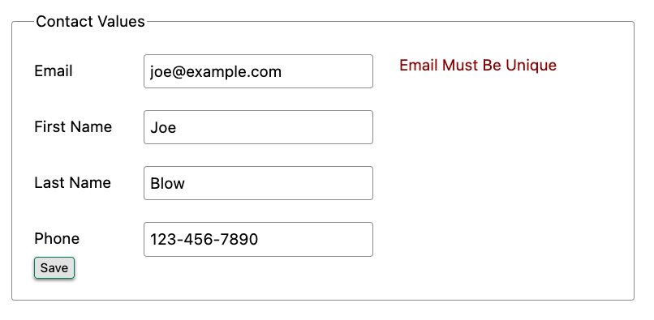
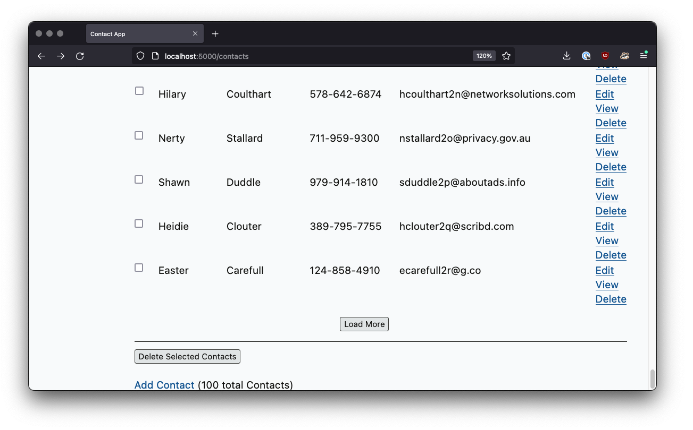

= Hypermedia In Action
:chapter: 4
:sectnums:
:figure-caption: Figure {chapter}.
:listing-caption: Listing {chapter}.
:table-caption: Table {chapter}.
:sectnumoffset: 3
// line above:  :sectnumoffset: 5  (chapter# minus 1)
:leveloffset: 1
:sourcedir: ../code/src
:source-language:

= Putting Hypermedia Into Action

This chapter covers

* Installing htmx in Contact.app
* Adding AJAX-based navigation to Contact.app via "boosting"
* Implementing a proper delete mechanic for contacts
* Validating emails as the user types
* Implementing paging in Contact.app
* Creating a "Click To Load" button
* Adding the "Infinite Scroll" pattern

== Installing htmx

Now that we've seen how htmx extends HTML as a hypermedia, it's time to put it into action.  We will still be
exchanging hypermedia, that is HTML, with our server: we will issue HTTP requests and get back HTML.  But, with the
additional functionality that htmx provides, we will have a more _powerful hypermedia_ to work with, allowing us to
accomplish much more sophisticated interfaces.  This will allow us to address user experience issues, such as long feedback
cycles or painful page refreshes, without needing to write much, if any, JavaScript, without creating a JSON API, and so
on: everything will be implemented in hypermedia, using the core concepts of the original web!

The first thing we need to do is install the htmx javascript library in our web application.  We are going to do this by downloading the
source and saving it locally in our application, so we aren't dependent on any external systems.  This is known as "vendoring"
the library.  We can grab the latest version of htmx by navigating our browser to `https://unpkg.com/htmx.org`, which will
redirect it to the latest version of the library.

We can save the content from this URL into the `static/js/htmx.js` file in our project.

You may, of course, use a more sophisticated JavaScript package manager such as Node Package Manager (NPM) or yarn to install
htmx by referring to it's package name, `htmx.org`, in the usual manner for your tool.  However, htmx is very small
(approximately 12kb when compressed and zipped) and is dependency free, so it does not require an elaborate mechanism or
build tool in order to install and use.

Now, with htmx downloaded locally to our system, we can now "install" the library.  We can do so by adding the
the following code to the `head` tag in our `layout.html` file, so it will be included on every page in our web
application:

[#listing-4-1, reftext={chapter}.{counter:listing}]
.Installing htmx
[source,html]
----
  <head>
    
    ...
  </head>
----

Recall that the `layout.html` file is a _layout_ file included in most templates that wraps the content of those templates
in common HTML, including a `head` element that we are using here to install htmx.

And, believe it or not, that's it!  No need to add a build step or anything else to our project, this simple inclusion of the htmx script
file will make its functionality available across our entire application.

== AJAX-ifying Our Application

The first feature of we are going to take advantage of is a bit of a "cheater" feature: `hx-boost`.  The `hx-boost`
attribute is unlike most other attributes in htmx.  Other htmx attributes tend to be very focused on
one aspect of improving HTML: `hx-trigger` focuses on the events that trigger a request, `hx-swap` focuses on how responses
are swapped into the DOM, and so forth.

The `hx-boost` attribute, in contrast, operates at a very high level: when you put it on an element with the value `true`,
it will "boost" all anchor tags and forms within that element.  Boost, in this case, means it will convert those elements
from regular anchor tags and forms into AJAX-powered anchors and forms.  This means that navigation will "feel" faster
because the browser will not be re-interpreting the `<head>` tags and so forth.

So boosted links, for example, rather than issuing a "normal" browser request, will issue an AJAX `GET` and replace
the whole body with the response.

=== Boosted Links

Let's take a look at an example of a boosted link.  Here we have a link to a hypothetical settings page.  Because it has
`hx-boost="true"` on it, htmx will prevent the normal link behavior of issuing a request to the `/settings` path and replacing
the entire page with the response.  Instead, htmx will issue an AJAX request to `/settings`, taking the result and replacing
the `body` element with the new content.

[#listing-4-1, reftext={chapter}.{counter:listing}]
.A Boosted Link
[source,html]
----
<a href="/settings" hx-boost="true">Settings</a> <1>
----
<1> A simple attribute makes this link AJAX-powered

Now, you might wonder: what's the advantage here?  We are issuing an AJAX request and simply replacing the entire body.

Is that significantly different from just issuing a normal link request?

The answer is yes: in a boosted link, the browser is able to avoid any processing associated with the head tag.  The head
tag often contains many scripts and CSS file references.  In the boosted scenario, it is not necessary to re-process those
resources: the scripts and styles have already been processed and will continue to apply to the new content.  This can
often be a very easy way to speed up your hypermedia application.

A second question you might have is: does the response have to be formatted specially to work with `hx-boost`?  After all,
the settings page would normally render an `html` tag, with a `head` tag and so forth.  Do you need to handle "boosted"
requests specially?

The answer in this case is no: htmx is smart enough to pull out only the content of the `body` tag to swap in to the new page.
The `head` tag, etc. are all ignored.  This means you don't need to do anything special on the server side to render
templates that `hx-boost` can handle: just return the normal HTML for your page, and it should work fine.

Note that boosted links (and forms) will also continue to update the navigation bar and history, so users will be able to use
the browser back button, be able to copy and paste URLs (or "deep links") and so forth.  It will act pretty much like
a "normal" web application, just faster.

=== Boosted Forms

Boosted form tags work in a similar way to boosted anchor tags: a boosted form will use an AJAX request rather than the
usual browser-issued request, and will replace the entire body with the response:

Here is an example of a form that posts messages to the `/messages` end point using an HTTP `POST` request.  By adding
`hx-boost` to it, those requests will be done in AJAX, rather than the normal browser behavior.

[#listing-4-2, reftext={chapter}.{counter:listing}]
.A Boosted Form
[source,html]
----
<form action="/messages" method="post" hx-boost="true"><1>
  <input type="text" name="message" placeholder="Enter A Message...">
  <button>Post Your Message</button>
</form>
----
<1> As with the link, a simple attribute makes this form AJAX-powered

Another advantage of the AJAX-based request that `hx-boost` uses is that it avoids what is known as a "flash of unstyled
content", which is when a page renders before all of the styling information has been downloaded for it.  This causes
a disconcerting momentary flash of the unstyled content.  The content is then restyled when all the style information is available.
You probably notice this as a flicker when you move around the internet: text, images and other content can "jump around"
on the page as styles are applied to it.

With `hx-boost` the sites styling is already loaded _before_ the content is retrieved, so there is no such flash of
unstyled content.  This can make a "boosted" application feel both smoother and snappier in general.

=== Attribute Inheritance

Let's expand on our previous example of a boosted link, and add a few more boosted links alongside it.  We add links
such that we have one to the `/contacts` page, the one to the `/settings` page, and one to the `/help` page.  All these
links are boosted and will behave in the manner that we have described above.

But this feels a little redundant, doesn't it?  It is a shame we have to annotate all three links with the `hx-boost="true"`,
right next to one another.

[#listing-4-3, reftext={chapter}.{counter:listing}]
.A Set of Boosted Links
[source,html]
----
<a href="/contacts" hx-boost="true">Contacts</a>
<a href="/settings" hx-boost="true">Settings</a>
<a href="/help" hx-boost="true">Help</a>
----

Luckily, htmx offers a feature to help reduce redundancy here: attribute inheritance.  With most attributes in htmx, if you
place it on a parent, it will also apply to all children elements.  This is how Cascading Style Sheets work, and that idea
inspired htmx to adopt a similar "cascading htmx attributes" concept.

So, to avoid the redundancy in this example, lets introduce a `div` element that encloses all the links and "hoist" the
`hx-boost` attribute up to it.  This will let us remove the redundant `hx-boost` attributes, but ensure all the links are
still boosted, inheriting that functionality from the parent `div`.  Note that any legal element type could be used here,
we just used a `div` out of habit.

[#listing-4-3, reftext={chapter}.{counter:listing}]
.Boosting Links Via The Parent
[source,html]
----

 <1>
    <a href="/contacts">Contacts</a>
    <a href="/settings">Settings</a>
    <a href="/help">Help</a>

----
<1> The `hx-boost` has been moved to the parent div

But what if you have a link that you _don't_ want boosted within an element that has `hx-boost="true"` on it?  A good
example is a link to a resource to be downloaded, such as a PDF.  Downloading a file can't be handled well by an AJAX
request, so you'd want that link to behave normally.

To deal with this situation, you would override the parent `hx-boost` value with `hx-boost="false"` on the element
in question:

[#listing-4-3, reftext={chapter}.{counter:listing}]
.Disabling Boosting
[source,html]
----

 <1>
    <a href="/contacts">Contacts</a>
    <a href="/settings">Settings</a>
    <a href="/help">Help</a>
    <a href="/help/documentation.pdf" hx-boost="false">Download Docs</a> <2>

----
<1> The `hx-boost` is still on the parent div
<2> The boosting behavior is overridden for this link

Here we have a new link to a documentation PDF that we wish to function normally.  We have added `hx-boost="false"` to
the link and this will override the `hx-boost="true"` on the parent, reverting this link to regular link behavior and
allowing the download behavior that we want.

=== Progressive Enhancement

A very nice aspect of `hx-boost` is that it "progressively enhances" web applications.  Consider the links in the
example above.  What would happen if someone did not have JavaScript enabled?  Nothing much!  The application would
continue to work, but it would issue regular HTTP requests, rather than AJAX-based HTTP requests.  This means that
your web application will work for the maximum number of users, with users of more modern browsers (or users who
have not turned off JavaScript) able to take advantage of the benefits of AJAX-style navigation, but other people
still able to use the app just fine.  This is sometimes called "graceful degredation" as well.

Compare this with a JavaScript heavy Single Page Application: it simply won't function without JavaScript, obviously.
It is very difficult to adopt a progressive enhancement approach within that model.

This is not to say that htmx _always_ offers progressive enhancement.  It is certainly possible to build features that
do not offer a "No JS" fallback in htmx, and, in fact, many of the features we will build later in the book will fall
into this category.  (I will note when a feature is progressive enhancement friendly and when it is not.)  Ultimately,
it is up to you, the developer, to decide if the tradeoffs of progressive enhancement (more basic UX functionality, a
limited improvement over plain HTML) are worth the benefits for your applications users.

=== Adding `hx-boost` to Contact.app

For our contact app we want this "boost" behavior... well, everywhere.  Right?  Why not?  How could we accomplish that?

Pretty darned easy: just add `hx-boost` on the `body` tag of our `layout.html` template, and be done with it!

[#listing-4-3, reftext={chapter}.{counter:listing}]
. Boosting The Entire Contact.app
[source,html]
----
<html>
...
<body hx-boost="true"><1>
...
</body>
</html>
----
<1> All links and forms will be boosted now!

Now every link and form in our application will use AJAX by default, making it feel much snappier!  Consider the
"New Contact" link on the main page:

. A Newly Boosted "Add Contact" Link
[source,html]
----
  <a href="/contacts/new">Add Contact</a>
----

Even though we haven't touched anything on this link or on the server side handling of the URL it targets, it will
now "just work" with AJAX (or, if JavaScript isn't enabled, using standard web navigation), including updating history,
back button support and so on.

All this with one, single attribute.  This extremely high power-to-weight ratio is why `hx-boost`, which is so different from
every other attribute in htmx, is part of the library.  It's just too good an idea not to include!

So, that's it, books over!  You've got yourself an AJAX-powered hypermedia application now!

Of course, I'm kidding.  There is a lot more to htmx, and there is a lot more room for improvement in our application,
so let's keep rolling.

== A Next Step: Deleting Contacts

In Chapter 2 you'll recall that we had a small form on the edit page of a contact to delete the contact:

[source, html]
.Plain HTML Form To Delete A Contact
----
    <form action="/contacts/{{ contact.id }}/delete" method="post">
        <button>Delete Contact</button>
    </form>
----

This form issued an HTTP `POST` to, for example, `/contacts/42/delete`, in order to delete the contact with the ID 42.

I mentioned previously that one of the tremendously annoying things about HTML is that you can't issue an HTTP `DELETE`
(or `PUT` or `PATCH`) request directly, even though these are all part of HTTP and HTTP is _obviously designed_ for
transferring HTML!  But now, with htmx, we have a chance to rectify this situation.

The "right thing", from a REST-ful, resource oriented perspective is, rather than issuing an HTTP `POST` to
`/contacts/42/delete`, to issue an HTTP `DELETE` to `/contacts/42`.  We want to delete the contact.  The contact is
a resource.  The URL for that resource is `/contacts/42`.  So the ideal situation is a `DELETE` to ``/contacts/42/`.

So, how can we update our application to do this while still staying within the hypermedia model?  We can simply take
advantage of the `hx-delete` attribute, like so:

[source, html]
.An htmx Powered Button For Deleting A Contact
----
  <button hx-delete="/contacts/{{ contact.id }}">Delete Contact</button>
----

Pretty simple!  There are two things, in particular, to notice about this new implementation:

* We no longer need a `form` tag to wrap the button, because the button itself carries the hypermedia action that
  it performs directly on itself.
* We no longer need to use the somewhat awkward `"/contacts/{{ contact.id }}/delete"` route, but can simply use the
  `"/contacts/{{ contact.id }}` route, since we are issuing a `DELETE`, which disambiguates the operation we are
  performing on the resource from other potential operations!

However, I should note, unlike with the `hx-boost` examples above, this solution will _not_ degrade gracefully.  To make
this solution degrade gracefully, we would need to wrap the button in a form element and handle a `POST` on the server
side as well.  In the interest of keeping things simple, we are going to omit that more elaborate solution.

=== Updating The Server Side

We have updated our client-side code, that is our HTML, so it now does "the right thing" from a hypermedia perspective:
we want to delete a contact, and we are issuing a `DELETE` request.  But we still have some work to do!  Since we
updated both the route and the HTTP action we are using, we are going to need to update the server side implementation
as well to handle this new HTTP Request.

Here is the original code:

[source, python]
----
@app.route("/contacts/<contact_id>/delete", methods=["POST"])
def contacts_delete(contact_id=0):
    contact = Contact.find(contact_id)
    contact.delete()
    flash("Deleted Contact!")
    return redirect("/contacts")
----

We are going to have to do two things: first we need to update the route for our handler to the new location and method
we are using to delete contacts.  This will be relatively straight forward.

Secondly, and this is a bit more subtle, we are going to need to change the HTTP Response Code that the flask handler
sends back to the client for this redirect.  Let's take a quick sidebar on what HTTP response codes are, and why they are
important to understand in this case.

==== HTTP Response Codes

HTTP Response Codes are numeric values that are embedded in an HTTP response that let the client know what the result
of a request was.  The most familiar response code for most web developers is `404`, which stands for "Not Found" and
is the response code that is returned by web servers when a resource that does not exist is requested.

HTTP breaks response codes up into various categories:

[cols="1,4"]
|===
|`100`-`199`
| Informational responses that provide information about how the server is processing the response

|`200`-`299`
| Successful responses indicating that the request succeeded

|`300`-`399`
| Redirection responses indicating that the request should be sent to some other URL

|`400`-`499`
| Client error responses indicating that the client made some sort of bad request (e.g. asking for something that didn't
  exist in the case of `404` errors)

|`500`-`599`
| Server error responses indicating that the server encountered an error internally as it attempted to respond to the request
|===

Within each of these categories there are multiple response codes for specific situations.  A good example is the `404 Not Found`
response code that we already mentioned, which indicates that the requested resource was not fount.  This is in contrast
with the `403 Forbidden` response code, which is still a "Client Error" response code, but which indicates that the current user
is not allowed to view the given resource.

Different response codes will often trigger different browser behaviors, so it is important to understand exactly which
one you are returning, especially as you get deeper into creating a Hypermedia Driven Application.

==== Returning To Our Handler

OK, now we are armed with a more in-depth understanding of what HTTP response codes are.  A problem with our current
delete handler is that, by default, in Flask the `redirect()` method responds with a `302` response code.  According to the
Mozilla Developer Network (MDN) web docs, this means that the HTTP method and body of the requests _will be unchanged_
when the redirected request is issued.

We are issuing a `DELETE` request with htmx and then being redirected to the `/contacts` path by flask.  According to this
logic, that would mean that the redirected request would still be a `DELETE` method, so we would issue a `DELETE` request
to `/contacts`!  Yikes!  That looks like a request to delete all the contacts in our system, doesn't it?

It wouldn't do that, of course, since we haven't implemented that behavior, but it is still definitely not what we want:
we'd like it to simply issue a `GET`, slightly modifying the Post/Redirect/Get behavior we discussed earlier to be a
Delete/Redirect/Get.

Fortunately for us, there is a response code, `303 See Other`, that does the right thing: when you respond with a 303
response code and a redirect, the browser will issue a `GET` to the new location.  So we want to use this response code
in our flask application.  Thankfully, this is very easy: there is a second parameter to `redirect()` that takes the
numeric response code you wish to send.

==== Putting It All Together

So we want to make the following changes to our server side code:

* We want to change the HTTP action associated with it to `DELETE`
* We want to remove the ugly `/delete` at the end of the path, since we are now using a proper HTTP action
* We want to be sure to issue a `303 See Other` response code so we properly issue a `GET` after the redirect

Here is our updated code:

[source, python]
----
@app.route("/contacts/<contact_id>", methods=["DELETE"]) <1>
def contacts_delete(contact_id=0):
    contact = Contact.find(contact_id)
    contact.delete()
    flash("Deleted Contact!")
    return redirect("/contacts", 303) <2>
----
<1> A slightly different path and method for the handler
<2> The response code is now a 303

Now, when you want to remove a given contact, you can simply issue a `DELETE` to the same URL as you used to access the
contact in the first place.  A much more natural HTTP approach to deleting a resource!

=== Targeting The Right Element

We aren't quite out of the woods yet, however.  As you may recall, by default htmx "targets" the element that triggers a request,
and will place the HTML returned by the server inside that element.  In this case, since the redirect to `/contacts` is
going to re-render the entire contact list, we will end up in the unfortunate situation where the entire list ends up
_inside_ the "Delete Contact" button!

Mis-targeting elements comes up from time to time in htmx and can lead to some pretty funny situations.

The fix for this is to add an explicit target to the button, targeting the `body` element with the response:

[source, html]
.A fixed htmx Powered Button For Deleting A Contact
----
  <button hx-delete="/contacts/{{ contact.id }}"
          hx-target="body"> <1>
    Delete Contact
  </button>
----
<1> We have added an explicit target to the button now

Now our button behaves as expected: clicking on the button will issue an HTTP `DELETE` to the server against the URL for
the current contact, delete the contact and redirect back to the contact list page, with a nice flash message.  Perfect!

=== Updating The Location Bar URL Properly

Well, almost.

If you click on the button you will notice that, despite the redirect, the URL in the location bar is
not correct.  It still points to `/contacts/{{ contact.id }}`.  This is because we haven't told htmx to update
the URL: it just issues the `DELETE` request and then updates the DOM with the response.

As we mentioned, boosting will naturally update the location bar for you, mimicking normal anchors and forms, but in
this case we are building a custom button because we want to issue a `DELETE`, something that is not possible in plain HTML.
So we need to let htmx know that we want the resulting URL from this request "pushed" into the location bar.

We can achieve this by adding the `hx-push-url` attribute with the value `true` to our button:

[source, html]
.Deleting A Contact, Now With Proper Location Information
----
  <button hx-delete="/contacts/{{ contact.id }}"
          hx-push-url="true" <1>
          hx-target="body">
    Delete Contact
  </button>
----
<1> We tell htmx to push the redirected URL up into the location bar

_Now_ we are done.  We have a button that, all by itself, is able to issue a properly formatted HTTP `DELETE` request to
the correct URL, and the UI and location bar are all updated correctly.  This was accomplished with three declarative
attributes placed directly on the button `hx-delete`, `hx-target` and `hx-push-url`.  Not only that, we were able to remove
the enclosing form tag as a bonus!  Pretty clean!

=== One Last Thing

And yet, if you are like me, something probably doesn't feel quite right here.  Deleting a contact is a pretty darned
destructive action, isn't it?  And what if someone accidentally clicked on the "Delete Contact" button when they meant
to click on the "Save" button?

As it stands now we would just delete that contact and too bad, so sad for the user.

Fortunately htmx has an easy mechanism for adding a confirmation message on destructive operations like this: the
`hx-confirm` attribute.  You can place this attribute on an element, with a message as its value, and the JavaScript
method `confirm()` will be called before a request is issued, which will show a simple confirmation dialog to the user
asking them to confirm the action.  Very easy and a great way to prevent accidents.

Here is how we would add confirmation of the contact delete operation:

[source, html]
.Confirming Deletion
----
  <button hx-delete="/contacts/{{ contact.id }}"
          hx-push-url="true"
          hx-confirm="Are you sure you want to delete this contact?" <1>
          hx-target="body">
    Delete Contact
  </button>
----
<1> This message will be shown to the user, asking them to confirm the delete

Now, when someone clicks on the "Delete Contact" button, they will be presented with a prompt that asks "Are you sure
you want to delete this contact?" and they will have an opportunity to cancel if they clicked the button in error.  Very
nice.

With this final change we now have a pretty solid "delete contact" mechanic: we are using the correct REST-ful routes
and HTTP Methods, we are confirming the deletion, and we have removed a lot of the cruft that normal HTML imposes on us,
all while using declarative attributes in our HTML and staying firmly within the normal hypermedia model of the web.

=== Progressive Enhancement?

One thing to note about our solution, however, is that it is _not_ a progressive enhancement to our web application: if
someone has disabled JavaScript then this functionality will no longer work.  You could do additional work to keep
the older mechanism working in a JavaScript-disabled environment, but it would introduce additional and redundant code.

Progressive Enhancement can be a hot-button topic in web development, with lots of passionate opinions and perspectives.
htmx, like most JavaScript libraries, makes it possible to create applications that do not function in the absence of
JavaScript. Retaining support for non-JavaScript clients requires additional work and complexity.  It is important to
determine exactly how important supporting non-JavaScript clients is before you begin using htmx, or any other JavaScript
framework, for improving your web applications.

== Next Steps: Validating Contact Emails

Let's move on to another improvement in our application: a big part of any web app is validating the data that is
submitted to the server side: ensuring emails are correctly formatted and unique, numeric values are valid, dates are
acceptable, and so forth.  Currently, our application has a small amount of validation that is done entirely server side
andthat displays an error message when an error is detected.

We are not going to go into the details of how validation works in the model objects, but recall what
the code for updating a contact looks like from Chapter 2:

[source, python]
.Server Side Validation On Contact Update
----
def contacts_edit_post(contact_id=0):
    c = Contact.find(contact_id)
    c.update(request.form['first_name'], request.form['last_name'], request.form['phone'], request.form['email'])
    if c.save(): <1>
        flash("Updated Contact!")
        return redirect("/contacts/" + str(contact_id))
    else:
        return render_template("edit.html", contact=c) <2>
----
<1> We attempt to save the contact
<2> If the save does not succeed we re-render the form to display error messages

So we attempt to save the contact, and, if the `save()` method returns true, we redirect to the contact's detail page.
If the `save()` method does not return true, that indicates that there was a validation error and so, instead of redirecting
we re-render the HTML for editing the contact.  This gives the user a chance to correct the errors, which are displayed
alongside the inputs.

Let's take a look at the HTML for the email input:

[source, html]
.Validation Error Messages
----

    <label for="email">Email</label>
    <input name="email" id="email" type="text" placeholder="Email" value="{{ contact.email }}">
    {{ contact.errors['email'] }}<1>

----
<1> Display any errors associated with the email field

We have a label for the input, an input of type `text` and then a bit of HTML to display any error messages associated
with the email.  When the template is rendered on the server, if there are errors associated with the contact's email, they will
be displayed in this span, which will be highlighted red.

.Server Side Validation Logic
****
Right now there is a bit of logic in the contact class that checks if there are any other contacts with
the same email address, and adds an error to the contact model if so, since we do not want to have duplicate emails in the
database.  This is a very common validation example: emails are usually unique and adding two contacts with the same email
is almost certainly a user error.

Again, we are not going to go into the details of how validation works in our models, in the interest of staying focused
on hypermedia, but whatever server side framework you are using almost certainly has some sort of infrastructure available
for validating data and collecting errors to display to the user.  This sort of infrastructure is very common in
Web 1.0 server side frameworks.
****

The error message shown when a user attempts to save a contact with a duplicate email is "Email Must Be Unique":

[#figure-4-1, reftext="Figure {chapter}.{counter:figure}"]
.Email Validation Error

All of this is done using plain HTML and using Web 1.0 techniques, and it works well.

However, as the application currently stands, there are two annoyances:

* First, there is no email format validation: you can enter whatever characters you'd like as an email and,
  as long as they are unique, the system will allow it
* Second, if a user has entered a duplicate email, they will not find this fact out until they have filled in
  all the fields because we only check the email's uniqueness when all the data is submitted.  This could be
  quite annoying if the user was accidentally reentering a contact and had to put all the contact information in
  before being made aware of this fact!

=== Updating Our Input Type

For the first issue, we have a pure HTML mechanism for improving our application: HTML 5 supports inputs of
type `email`!  All we need to do is switch our input from type `text` to type `email`, and the browser will
enforce that the value entered properly matches the email format:

[source, html]
.Changing The Input To Type `email`
----

    <label for="email">Email</label>
    <input name="email" id="email" type="email" placeholder="Email" value="{{ contact.email }}"> <1>
    {{ contact.errors['email'] }}

----
<1> A simple change of the `type` attribute to `email` ensures that values entered are valid emails

With this change, when the user enters a value that isn't a valid email, the browser will display an
error message asking for a properly formed email in that field.

So a simple single-attribute change done in pure HTML improves our validation and addresses the first
annoyance we noted!

Not bad!

.Server Side vs. Client Side Validations
****
More experienced web developers might be grinding their teeth a bit at the code above: this validation
is done entirely on _the client side_.  That is, we are relying on the browser to detect the malformed
email and correct the user.  Unfortunately, the client side is not trustworthy: a browser may have a
bug in it that allows the user to circumvent the validation code.  Or, worse, the user may be malicious
and figure out a mechanism around our validation entirely.  For example: they could simply inspect the
email input and revert its type to text.

This is a perpetual danger in web development: all validations done on the client side cannot be trusted
and, if the validation is important, _must be redone_ on the server side.  This is less of a problem in
Hypermedia Driven Applications than in Single Page Applications, because the focus of HDAs is the server
side, but it is still something worth bearing in mind as you build your application!
****

=== Inline Validation

While we have improved our validation experience a bit, the user must still submit the form to get any feedback
on duplicate emails.  We can use htmx to improve this user experience.

It would be better if the user were able to see a duplicate email error immediately after entering the email value.  It
turns out that inputs fire a `change` event and, in fact, the `change` event is the _default trigger_ for inputs in htmx.
So, what we want to have happen is as follows: when the user enters an email, we immediately issue a request to the server
and validate that email, and render an error message if necessary.

Recall the current HTML for our email input:

[source, html]
.The Initial Email Configuration
----

    <label for="email">Email</label>
    <input name="email" id="email" type="email" placeholder="Email" value="{{ contact.email }}"> <1>
    {{ contact.errors['email'] }} <2>

----
<1> This is the input that we want to have drive an HTTP request to validate the email
<2> This is the span we want to put the error message, if any, into

So we want to add an `hx-get` to this input, which will cause it to issue an HTTP `GET` request to a given URL to validate
the email.  We then want to target the error span following the input with any error message returned from the server.

Let's make those changes to our HTML:

[source, html]
.Our Updated HTML
----

    <label for="email">Email</label>
    <input name="email" id="email" type="email"
           hx-get="/contacts/{{ contact.id }}/email" <1>
           hx-target="next .error" <2>
           placeholder="Email" value="{{ contact.email }}"> <1>
    {{ contact.errors['email'] }}

----
<1> Issue an HTTP `GET` to the `email` endpoint the contact
<2> Target the next element with the class `error` on it

Now, with these two simple attributes in place, whenever someone changes the value of the input (remember, `change` is the
_default_ trigger for inputs in htmx) an HTTP request will be issued to the given URL and, if there are any errors, they
will be loaded into the error span.

=== Validating Emails Server Side

Next, let's look at the server side implementation.  We are going to add another end point, similar to our edit
end point in some ways: it is going to look up the contact based on the ID encoded in the URL.  In this case, however,
we only want to update the email of the contact, and we obviously don't want to save it!  Instead, we will call the
`validate()` method on it.

That method will validate the email is unique and so forth.  At that point we can return any errors associated with the
email directly, or the empty string if none exist.

Here is the code:

[source, python]
.Our Email Validation End-Point
----
@app.route("/contacts/<contact_id>/email", methods=["GET"])
def contacts_email_get(contact_id=0):
    c = Contact.find(contact_id) <1>
    c.email = request.args.get('email') <2>
    c.validate() <3>
    return c.errors.get('email') or "" <4>
----
<1> Look up the contact by id
<2> Update its email (note that since this is a `GET`, we use the `args` property rather than the `form` property)
<3> Validate the contact
<4> Return a string, either the errors associated with the email field or, if there are none, the empty string

With this small bit of code in place, we now have the following very nice user experience: when a user enters an email
and tabs to the next field, they are immediately notified if the email is already taken!

Note that the email validation is _still_ done when the entire contact is submitted for an update, so there is no danger
of allowing duplicate email contacts to slip through: we have simply made it possible for users to catch this situation
earlier by use of htmx.

It is also worth noting that this email validation _must_ be done on the server side: you cannot
determine that an email is unique across all contacts unless you have access to the data store of record.  This is another
simplifying aspect of Hypermedia Driven Applications: since validations are done server side, you have access to all
the data you might need to do any sort of validation you'd like.

Here again I want to stress that this interaction is done entirely within the hypermedia model: we are using declarative
attributes to exchange hypermedia with the server in a manner very similar to how links or forms work, but we have managed
to improve our user experience dramatically!

=== Taking Our User Experience Further

Now, despite the fact that we haven't written a lot of code here, this is a fairly sophisticated user interface, at
least when compared with plain HTML-based applications.  However, if you have used more advanced web applications you
have probably seen the pattern where an email field (or similar) is validated _as you type_.

This is surely beyond the reach of a Hypermedia Driven Application, right?  Only a sophisticated Single Page Application
framework could provide that level of interactivity!

Oh ye of little faith.  With a bit more effort, we can use htmx to achieve this user experience.

In fact, all we need to do is to change our trigger.  Currently, we are using the default trigger for inputs, which is the
`change` event.  To validate as the user types, we would want to capture the `keyup` event as well:

[source, html]
.Triggering With `keyup` Events
----

    <label for="email">Email</label>
    <input name="email" id="email" type="email"
           hx-get="/contacts/{{ contact.id }}/email"
           hx-target="next .error"
           hx-trigger="change, keyup" <1>
           placeholder="Email" value="{{ contact.email }}">
    {{ contact.errors['email'] }}

----
<1> An explicit trigger has been declared, and it triggers on both the `change` and `keyup` events

With this tiny change, every time a user types a character we will issue a request and validate the email!  Simple!

=== Debouncing Our Validation Requests

Unfortunately, this is probably not what you want: issuing a new request on every key up event would be very wasteful
and could potentially overwhelm your server.  What we want to do is only issue the request if the user has paused for
a small amount of time.  This is called "debouncing" the input, where requests are delayed until things have "settled down".

htmx supports a `delay` modifier for triggers that allows you to debounce a request by adding a delay before the request
is sent. If another event of the same kind appears within that interval, htmx will not issue the request and will reset
the timer.  This is exactly what we want for this situation: if the user is busy typing in an email we won't interrupt them,
but as soon as they pause or leave the field, we'll issue a request.

Let's add a delay of 200 milliseconds to the `keyup` trigger, which is long enough to detect that the user has stopped
typing.:

[source, html]
.Debouncing the `keyup` Event
----

    <label for="email">Email</label>
    <input name="email" id="email" type="email"
           hx-get="/contacts/{{ contact.id }}/email"
           hx-target="next .error"
           hx-trigger="change, keyup delay:200ms" <1>
           placeholder="Email" value="{{ contact.email }}">
    {{ contact.errors['email'] }}

----
<1> We debounce the `keyup` event by adding a `delay` modifier

Now we no longer issue a stream of validation requests as the user types.  Instead, we wait until the user pauses for
a bit and then issue the request.  Much better for our server, and still a great user experience!

=== Ignoring Non-Mutating Keys

There is one last thing we might want to address: as it stand we will issue a request no matter _which_ keys are pressed,
even if they are keys like the arrow keys, which have no effect on the value of the input.  It would be nice if there were
a way to only issue a request if the input value has changed.  It turns out that htmx has support for that pattern using
the `changed` modifier for events.  (Not to be confused with the `change` event!)

By adding `changed` to our `keyup` trigger, the input will not issue validation requests unless the keyup event actually
updates the inputs value:

[source, html]
.Only Sending Requests When The Input Value Changes
----

    <label for="email">Email</label>
    <input name="email" id="email" type="email"
           hx-get="/contacts/{{ contact.id }}/email"
           hx-target="next .error"
           hx-trigger="change, keyup delay:200ms changed" <1>
           placeholder="Email" value="{{ contact.email }}">
    {{ contact.errors['email'] }}

----
<1> We do away with pointless requests by only issuing them when the inputs value has actually changed

Now that's some pretty good-looking ode!

With a total of three attributes and a simple new server-side end point, we
have added a fairly sophisticated user experience to our web application.   Even better, any email validation rules we
add on the server side will _automatically_ just work using this model: because we are using hypermedia as our
communication mechanism there is no need to keep a client-side and server-side model in sync with one another.

This is a great demonstration of the power of the hypermedia architecture!

== Another Improvement: Paging

Currently, our application does not support paging: if there are 10,000 contacts in the database we will show
10,000 contacts on the main page!  Let's fix that, so that we only show ten contacts at a time with a "Next" and
"Previous" link if there are more than 10 or if we are beyond the first page.

The first change we will need to make is to add a simple paging widget to our `index.html` template.  Here
we will conditionally include two links:

* If we are beyond the first page, we will include a link to the previous page
* If there are ten contacts in the current result set, we will include a link to the next page

This isn't a perfect paging widget: ideally we'd show the number of pages and offer the ability to do more
specific page navigation, and there is the possibility that the next page might have 0 results in it since
we aren't checking the total results count, but it will do for now for our simple application.

Let's look at the jinja template code for this.

[source, html]
.Adding Paging Widgets To Our List of Contacts
----

     <1>
        
          <a href="/contacts?page={{ page - 1 }}">Previous</a> <2>
        
        
          <a href="/contacts?page={{ page + 1 }}">Next</a> <3>
        
    

----
<1> Include a new div under the table to hold our navigation links
<2> If we are beyond page 1, include an anchor tag with the page decremented by one
<3> If there are 10 contacts in the current page, include an anchor tag linking to the next page by incrementing it by one

Note that here we are using the special jinja syntax `contacts|length` to compute the length of the contacts
list.

Now lets address the server side implementation.

We need to look for the `page` parameter and pass that through to our model as an integer so the model knows
what page of contacts to return:

[source, python]
.Adding Paging To Our Request Handler
----
@app.route("/contacts")
def contacts():
    search = request.args.get("q")
    page = int(request.args.get("page", 1)) <1>
    if search is not None:
        contacts_set = Contact.search(search)
    else:
        contacts_set = Contact.all(page) <2>
    return render_template("index.html", contacts=contacts_set, page=page)
----
<1> Resolve the page parameter, defaulting to page 1 if no page is passed in
<2> Pass the page through to the model when loading all contacts so it knows which page of 10 contacts to
    return

This is fairly straightforward: we just need to get another parameter, like the `q` parameter we passed in for
searching contacts earlier, convert it to an integer and then pass it through to the `Contact` model so it
knows which page to return.

And that's it.  We now have a very basic paging mechanism for our web application.  And, believe it or not,
it is already using AJAX, thanks to our use of `hx-boost` in the application.  Easy!

=== Click To Load

Now, the current paging mechanism is fine, although it could use some additional polish.  But sometimes you
don't want to have to page through items and lose your place in the application.  In cases like this a different
UI pattern might be better.  For example, you may want to load the next page _inline_ in the current page.  This
is the common "click to load more" UX pattern:

[#figure-1-1, reftext="Figure {chapter}.{counter:figure}"]
.A Click To Load UI

Here, you have a button that you can click, and it will load the next set of contacts directly into the page, rather
than "paging" to the next page.  This allows you to keep the current contacts "in context" visually on the page, but
still progress through them as you would in a normal, paged user interface.

Let's see how we can implement this in htmx.

It's actually surprisingly simple: we can just take the existing "Next" link and repurpose it a bit using
nothing but htmx attributes!

We want to have a button that, when clicked, appends the rows from the next page of contacts to the current,
exiting table, rather than re-rendering the whole table.  This can be achieved by adding a row to our table
that has just such a button in it:

[source, html]
.Changing To "Click To Load"
----
        <tbody>
        
            <tr>
                <td>{{ contact.first }}</td>
                <td>{{ contact.last }}</td>
                <td>{{ contact.phone }}</td>
                <td>{{ contact.email }}</td>
                <td><a href="/contacts/{{ contact.id }}/edit">Edit</a> <a href="/contacts/{{ contact.id }}">View</a></td>
            </tr>
        
         <1>
            <tr>
                <td colspan="5" style="text-align: center">
                    <button hx-target="closest tr" <2>
                            hx-swap="outerHTML"   <3>
                            hx-select="tbody > tr" <4>
                            hx-get="/contacts?page={{ page + 1 }}">Load More</button>
                </td>
            </tr>
        
        </tbody>
----
<1> As with the "Next" link in our paging example, we only show "Load More" if there are 10 contact results in the current page
<2> In this case, the button needs to target the closest enclosing row, which is what the `closest` syntax allows
<3> We want to replace this row with the response from the server
<4> Of course, we don't want to replace the row with the entire response, we only want to replace it with the
    rows within the table body of the response, so we use the `hx-select` attribute to select those rows out using
    a standard CSS selector

Believe it or not, that's all we need to change to enable a "Click To Load" style UI!  No server side changes are necessary
because of the flexibility that htmx gives you with respect to how we process server responses.  Pretty cool, eh?

==== Relative Positional Targets

Here we saw the first example of a target that was "relatively positioned": `closest tr`.  The `closest` keyword indicates
that the closest parent that matches the following CSS selector is the target.  So in this example the target was the
`tr` that was enclosing the button.

htmx also supports `next` and `previous` relative positional expressions, allowing you to target the next element or
previous element that matches a given CSS selector.

Relative positional expressions like this are quite powerful and allow you to avoid having to generate `id` attributes
in your HTML just so you can target a particular element.

=== Infinite Scroll

Another somewhat common pattern for dealing with long lists of things is known as "infinite scroll", where,
as the end of a list or table is scrolled into view, more elements are loaded.  This behavior makes more sense
in situations where a user is exploring a category or series of social media posts, rather than in the context of
a contact application, but for completeness we will show how to achieve this in htmx.

We can repurpose the "Click To Load" code to implement this new pattern.  If you think about it for a moment, really
infinite scroll is just the "Click To Load" logic, but rather than loading when a click occurs, we want to
load when an element is "revealed" in the view portal of the browser.

As luck would have it, htmx offers a synthetic (non-standard) DOM event, `revealed` that can be used in tandem
with the `hx-trigger` attribute, to trigger a request when, well, when an element is revealed.  Let's convert
our button to a span and take advantage of this event:

[source, html]
.Changing To "Infinite Scroll"
----
 <1>
    <tr>
        <td colspan="5" style="text-align: center">
            <span<1>hx-target="closest tr"
                    hx-trigger="revealed" <2>
                    hx-swap="outerHTML"
                    hx-select="tbody > tr"
                    hx-get="/contacts?page={{ page + 1 }}">Loading More...
        </td>
    </tr>

----
<1> We have converted our element from a button to a span, since the user will not be clicking on it
<2> We trigger the request when the element is revealed, that is when it comes into view in the portal

So all we needed to do to convert from "Click to Load" to "Infinite Scroll" was update our element to be
a span and add the `revealed` trigger.  The fact that this was so easy shows how well htmx generalizes
HTML: just a few attributes allow us to dramatically expand what we can achieve with our hypermedia.  And,
again, I note that we are doing all this within the original, REST-ful model of the web, exchanging hypermedia
with the server.  As the web was designed!

== Summary

* Hypermedia-Driven Applications (HDA) can be made more interactive by using the htmx library
* A simple and quick way to improve the application was to use the `hx-boost` attribute, which "boosts"
  all links and forms to use AJAX interactions
* Deleting a contact could be updated to use the proper `DELETE` HTTP request, using the `hx-delete` attribute
* Validating the email of a contact as the user entered it was achieved using a combination of `hx-get` and `hx-target`
* AJAX-based paging, in addition to the "Click To Load" and "Infinite Scroll" patterns, can be implemented simply and cleanly
  using htmx.

