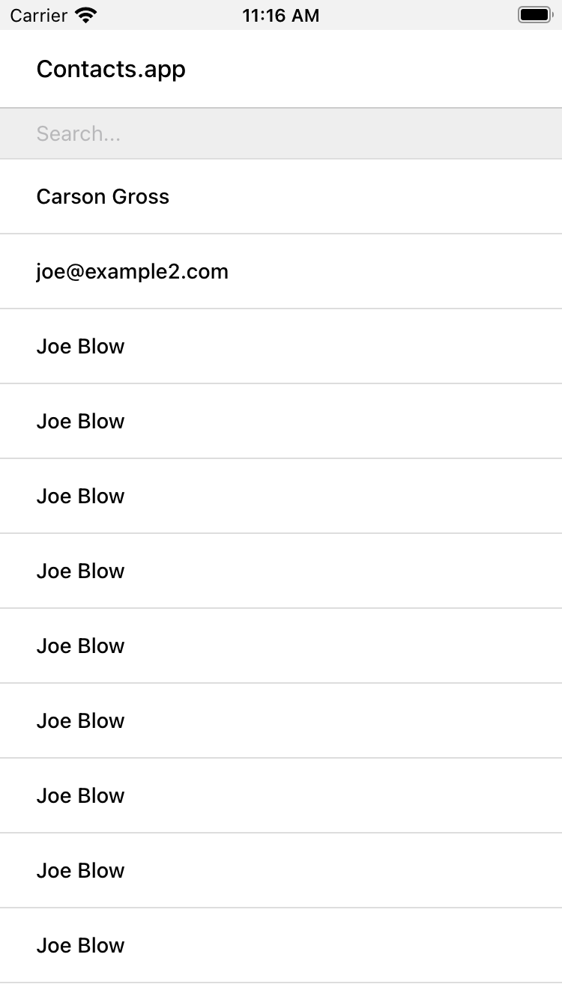

= Hypermedia In Action
:chapter: 7
:sectnums:
:figure-caption: Figure {chapter}.
:listing-caption: Listing {chapter}.
:table-caption: Table {chapter}.
:sectnumoffset: 2
// line above:  :sectnumoffset: 5  (chapter# minus 1)
:leveloffset: 1
:sourcedir: ../code/src
:source-language:

= Building a Contacts App With Hyperview
* We will take our existing Contacts web app, and transform it to a mobile app just by tweaking the backend responses.
* To enhance our app and make it more native, we will extend the Hyperview client with custom components and behaviors.
* Finally, our Contacts app can serve both a web app and mobile app, just by tweaking the Hypermedia response!

== TODO: Porting from Web

* We can use the same backend code
* We only care about supporting mobile right now. Later we will look at running both.
* Modify the code as little as possible will make it easier to support both.
* Currently, our views render HTML templates for the response.
* For Hyperview, we will create a set of XML templates to use instead.

=== Installation
Prerequisites
 * You already have the contacts app from earlier chapters running locally and listening on port 5000
 * You have an Android Emulator or iOS simulator running on your computer. For the installation instructions

Hyperview repository comes with a demo backend and a demo client built using Expo.
We will use this demo client but point it to our contacts app backend as a starting point.

[source,bash]
----
> git clone git@github.com:Instawork/hyperview.git
> cd hyperview/demo
> yarn <1>
> yarn start <2>
----
<1> Install dependencies for the demo app
<2> Start the Expo server to run the mobile app in the iOS simulator.

With any luck, you will see the Expo mobile app installed in the simulator.
The mobile app will automatically launch and show a screen saying "Network request failed."
That's because by default, this app is configured to make a request to `http://0.0.0.0:8085/index.xml`, but our backend is listening on port 5000.
To fix this, we can make a simple configuration change in the `demo/src/constants.js` file:

[source,js]
----
//export const ENTRY_POINT_URL = 'http://0.0.0.0:8085/index.xml'; <1>
export const ENTRY_POINT_URL = 'http://0.0.0.0:5000/contacts'; <2>
----
<1> The default entrypoint URL in the demo app
<2> Setting the URL to point to our contacts app

We're not up and running yet.
With our mobile app now pointing to the right endpoint, we see a different error screen with a "ParseError" message.
That's because the backend is responding to requests with HTML content, but our Hyperview app expects an XML response (specifically, HXML).
We can now switch gears to our Flask backend, and replace the HTML templates with HXML templates.

=== A Searchable List of Contacts
We will start building our Hyperview app with the entrypoint screen, the list of contacts.
For the initial version of this screen, let's support the following features from the web app:
- display a scrollable list of contacts
- "infinite-scroll" to load more contacts as the user scrolls through
- "search-as-you-type" field above the list
Additionally, we will add a "pull-to-refresh" interaction on the list, since users expect this from list UIs in mobile apps.

If you recall, all of the pages in the Contacts web app extended a common base template, `layout.html`.
We need a similar base template called for the screens of the mobile app.
This base template will contain the style rules or our UI, and a basic structure common to all screens.
Let's call it `layout.xml`.

.Base template `hv/layout.xml`
[source,xml]
----
<doc xmlns="https://hyperview.org/hyperview">
  <screen>
    <styles><!-- ommitted for brevity --></styles>
    <body style="body" safe-area="true">
      <header style="header">
         <1>
          <text style="header-title">Contacts.app</text>
        
      </header>

      <view style="main">
         <2>
      </view>
    </body>
  </screen>
</doc>
----
(1) The header section of the template, with a default title
(2) The content section of the template, to be provided out by other templates.

We covered the HXML tags and attributes in the previous chapter.
This template sets up a basic screen layout using `<doc>`, `<screen>`, `<body>`, `<header>`, and `<view>` tags.
Note that the HXML syntax plays well with the Jinja templating library.
Here, we're using Jinja's blocks to define two sections (`header` and `content`) that will hold the unique content of a screen.
With our base template completed, we can create a template specifically for the contacts list screen.

.Start of `hv/index.xml`
[source,xml]
----
 <1>

 <2>
  <form> <3>
    <text-field name="q" value="" placeholder="Search..." style="search-field" />
    <list id="contacts-list"> <4>
      
    </list>
  </form>

----
<1> Extend the base layout template
<2> Override the `content` block of the layout template
<3> Create a search form that will issue an HTTP `GET` to `/contacts`
<4> The list of contacts, using a Jinja `include` tag.

This template extends the base `layout.xml`, and overrides the `content` block with a `<form>`.
At first, it might seem strange that the form wraps both the `<text-field>` and the `<list>` elements.
But remember: in Hyperview, the form data gets included in any request originating from a child element.
We will soon add interactions to the list (pull to refresh) that will require the form data.
Note the use of a Jinja `include` tag to render the HXML for the rows of contacts in the list (`hv/rows.xml`).
Just like in the HTML templates, we can use the `include` to break up our HXML into smaller pieces.
It also allows the server to respond with just the `rows.xml` template for interactions like searching, infinite scroll, and pull-to-refresh.

.`hv/rows.xml`
[source,xml]
----
<items xmlns="https://hyperview.org/hyperview"> <1>
   <2>
    <item key="{{ contact.id }}" style="contact-item"> <3>
      <text style="contact-item-label">
        
          {{ contact.first }} {{ contact.last }}
        
          {{ contact.phone }}
        
          {{ contact.email }}
        
      </text>
    </item>
  
</items>
----
<1> An HXML element that groups a set of `<item>` elements in a common parent
<2> Iterate over the contacts that were passed in to the template
<3> Render an `<item>` for each contact, showing the name, phone number, or email.

In the web app, each row in the list showed the contact's name, phone number, and email address.
But in a mobile app, we have less real-estate.
It would be hard to cram all this information into one line.
Instead, the row just shows the contact's first and last name, and falls back to email or phone if the name is not set.
To render the row, we again make use of Jinja template syntax to render dynamic text with data passed to the template.

We now have templates for the base layout, the contacts screen, and the contact rows.
But we still have to update the Flask views to use these templates.
Let's take a look at the `contacts()` view in its current form, written for the web app:

.`app.py`
[source,py]
----
@app.route("/contacts")
def contacts():
    search = request.args.get("q")
    page = int(request.args.get("page", 1))
    if search:
        contacts_set = Contact.search(search)
        if request.headers.get('HX-Trigger') == 'search':
            return render_template("rows.html", contacts=contacts_set, page=page)
    else:
        contacts_set = Contact.all(page)
    return render_template("index.html", contacts=contacts_set, page=page)
----

This view supports fetching a set of contacts based on two query params, `q` and `page`.
It also decides whether to render the full page (`index.html`) or just the contact rows (`rows.html`) based on the `HX-Trigger` header.
This is where we have a minor problem.
The `HX-Trigger` header is set by the htmx library; there's no equivalent feature in Hyperview.
Moreover, there are multiple scenarios in Hyperview that require us to respond with just the contact rows:
- searching
- pull-to-refresh
- loading the next page of contacts

Since we can't depend on a header like `HX-Trigger`, we will instead introduce another query param, `rows_only`.
When this param has the value `true`, the view will respond to the request by rendering the `rows.xml` template.
Otherwise, it will respond with the `index.xml` template:

.`app.py`
[source,py]
----
@app.route("/contacts")
def contacts():
    search = request.args.get("q")
    page = int(request.args.get("page", 1))
    rows_only = request.args.get("rows_only") == "true" <1>
    if search:
        contacts_set = Contact.search(search)
    else:
        contacts_set = Contact.all(page)

    template_name = "hv/rows.xml" if rows_only else "hv/index.xml" <2>
    return render_template(template_name, contacts=contacts_set, page=page)
----
<1> Check for a new `rows_only` query param
<2> Render the appropriate HXML template based on `rows_only`

There's one more change we have to make.
By default, Flask assumes the view will respond with HTML.
So if defaults the `Content-Type` header to a value of `text/html`.
The Hyperview client expects to receive XML content, so we need to set this explicitly in our Flask app.
We will do this by introducing a new helper function, `render_to_response()`:

.`app.py`
[source,py]
----
def render_to_response(template_name, *args, **kwargs):
    content = render_template(template_name, *args, **kwargs) <1>
    response = make_response(content) <2>
    response.headers['Content-Type'] = 'application/xml' <3>
    return response
----
<1> Renders the given template with the supplied arguments and keyword arguments.
<2> Create an explicit response object with the rendered template
<2> Sets the response `Content-Type` header to XML.

As you can see, this helper function uses `render_template()` under the hood.
`render_template()` returns a string.
This helper uses that string to create an explicit `Response` object.
We can then set headers on the response.
Specifically, we can set `Content-Type` to `application/xml` so that the Hyperview client recognizes the content.
This helper is a drop-in replacement for `render_template` in our views.
So all we need to do is update the last line of the `contacts()` function.

.`contacts() function`
[source,py]
----
return render_to_response(template_name, contacts=contacts_set, page=page) <1>
----
<2> Render the HXML template to an XML response.

With these changes to the `contacts()` view, we can finally see the fruits of our labor.
After restarting the backend and refreshing the screen in our mobile app, we can see the contacts screen!

[#figure-7-1, reftext="Figure {chapter}.{counter:figure}"]
.Contacts Screen

==== TODO: Searching

==== TODO: Pull-to-refresh

==== TODO: Infinite scroll

=== Adding a New Contact

=== Viewing The Details Of A Contact
   * Show data and buttons to edit/delete
   * Edit button: replace data with form
      * On submit: show spinner, then go back
   * Delete button: show spinner, then go back
   * Problem: Contacts screen is not updated!
      * Solution: add event dispatch, contacts screen listens to updates

=== Editing a Contact

=== Deleting a Contact

== TODO: Extending the Client
* Problem: how to show a toast confirming the action?
   * Remember, no scripting to add functionality
   * Need to extend Hyperview with a toast component
   * Find a RN library, show how to wrap it as custom component.
   * Why behavior? Not tied to a screen

* Problem: we want quick access to edit and delete actions.
* This is present in the web app
* Our mobile app has less screen real estate
* Typically this is solv

* Problem: we want to call/email our contacts.
  * Remember, no scripting to add functionality
  * Need to extend Hyperview with behaviors for sms, call, email
  * Find a RN library, show how to wrap it as custom behaviors.

* With custom components and behaviors, we can do almost anything a native app can do.
* Note how we cleanly extend the client:
  * HXML remains pure XML, no scripts
  * We've essentially added features to the Hyperview "browser" that we need

== TODO: One Backend, Multiple Hypermedias
* We turned out simple Contacts app into a native mobile app
  * mostly, we changed templates from HTML to HXML
* But the app doesn't work on the web anymore.
* Can we use the same backend for both a rich web app and a native mobile app?
* Yes! The same backend logic can be used for both, we just need to respond with HTML or HXML based on the client.
* There are a couple of relevant approaches.
* The important thing is to detect whether the client speaks HTML or HXML.
  * Luckily, this is what the HTTP Accept header is for!
  * HV client uses two headers: one for full docs, and one for fragments
* Using the Accept header, we know if the client is a web browser of mobile app using Hyperview, and we can respond with HTML or HXML.
* But what's the best way to organize our code? Two approaches to consider with different tradeoffs:

* Approach 1: share the same view, but select template based on header
  * easiest approach, minor changes
  * works well if the interactions on both platforms is the same
  * may not be the best approach if the two platforms have different behaviors

* Approach 2: share the same model logic, but create separate views
  * some duplication required to parse requests
  * the context can be uniquely crafted for the given platform
