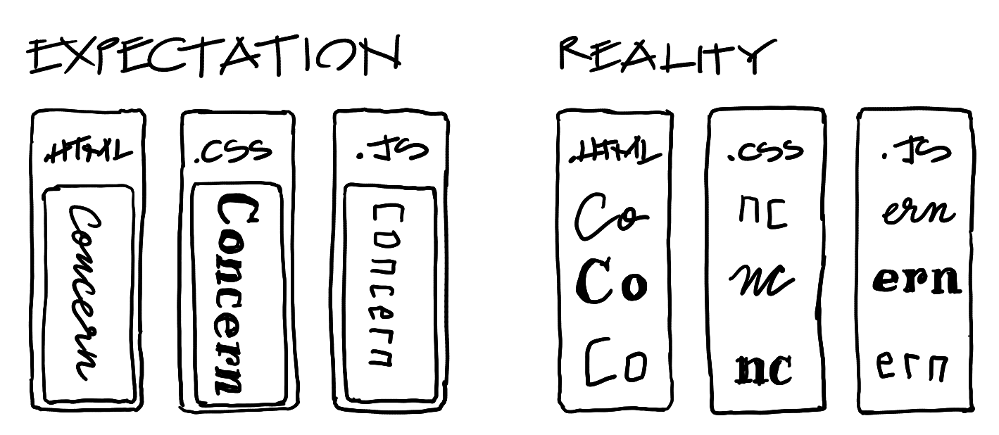

= Hypermedia In Action
:chapter: 8
:sectnums:
:figure-caption: Figure {chapter}.
:listing-caption: Listing {chapter}.
:table-caption: Table {chapter}.
:sectnumoffset: 7
// line above:  :sectnumoffset: 7  (chapter# minus 1)
:leveloffset: 1
:sourcedir: ../code/src
:source-language:

= Client Side Scripting

This chapter covers

* How scripting can be effectively added to a Hypermedia Driven Application
* Adding a javascript-based confirmation dialog for deleting contacts
// js
* Adding a three-dot menu in our contacts table
// alpine
* Adding a keyboard shortcut for focusing the search input
// hyperscript
* Adding support for re-ordering contacts via drag-and-drop
// off the shelf

[partintro]
== Scripting in Hypermedia-Driven Applications

"REST allows client functionality to be extended by downloading and executing code in the form of applets or scripts. This simplifies clients by reducing the number of features required to be pre-implemented."
-- Roy Fielding, Architectural Styles and the Design of Network-based Software Architectures

Thus far we have avoided writing any JavaScript for Contact.app, mainly because the functionality we implemented so far does not need it. Contrary to popular belief, hypermedia is not just for "documents" (where a document is considered essentially different to an "app"), and it has many affordances for building interactive experiences. We want to show that it is possible to build sophisticated web applications using the original model of the web without the abstractions provided by JavaScript frameworks. On the other hand, htmx itself is written in JavaScript, and we don't want our message to be interpreted as "JavaScript bad", or, more generally, "Client-side scripting bad."

image::htmx-loves-javascript.png[]

Scripting has been a massive multiplier of the Web's capabilities. Through its use, Web application authors are not only able to enhance their hypertext-based websites, but also create full-fledged client-side applications that can compete with native apps in how they work (although they don't always win when they do).

In other terms, the Web became a distribution medium for non-REST apps in addition to being a RESTful system.

So the question isn't "Should we be scripting for the web?" but rather "How should we be scripting for the web?"

Scripting, when it's used as a replacement for the RESTful architecture provided by the Web, is extremely useful in Hypermedia Driven Applications. We discuss what this means in much greater detail in an appendix, but the practical implications for HDA developers is that if

* The main data format exchanged between server of client is hypermedia, the same as it would be in an application with no scripting,
* Client-side state (other than the DOM) is minimized,

then you are scripting in a way compatible with HDAs.

This style of scripting requires us to different practices than what is usually recommended for JavaScript, as the most common advice often comes from a server or SPA context. We will see these practices in action in the upcoming chapter.

However, listing "best practices" is rarely convincing or edifying (and often boring). So, we instead frame them around shiny tools that work well for scripting in a HDA. We will use each of these tools to add a feature to ContactApp:

* An overflow menu to hold the _Edit_, _View_ and _Delete_ actions, to clean up visual clutter in our list of contacts
* Reordering contacts by dragging and dropping
* A dialog to confirm the deletion of contacts
* A keyboard shortcut for focusing the search box

The important idea in the implementation of each of these features is that they are entirely client-side and don't exchange information with the server using, for example, JSON. This is what will keep them all within the bounds of a proper Hypermedia Driven Application.

== Scripting tools for the Web

The primary scripting language for the web is, of course, JavaScript, which is ubiquitous in web development today. A bit of interesting internet lore, however, is that JavaScript was not always the only built-in option. As the quote from Roy Fielding above indicates, _applets_ written in other languages such as Java were considered part of the scripting infrastructure of the web. In addition, there was a brief period when Internet Explorer supported VBScript, a scripting language based on Visual Basic.

Today, we have a variety of _transcompilers_ (often shortened to _transpilers_) that convert another language to JavaScript, such as TypeScript, Dart, Kotlin, ClojureScript, F#. There is also the WebAssembly bytecode format, which is supported as a compilation target for C, Rust, and the WASM-specific language AssemblyScript. However, most of these are not geared towards an HDA-compatible style of scripting --- compile-to-JS languages are paired with SPA-oriented libraries, and WASM is mainly geared toward linking to existing C/C++ libraries from JavaScript.

I bring this up because we are going to look at three different mechanisms for adding scripting to our Hypermedia Driven Application:

* VanillaJS, that is, using JavaScript itself, without relying on any library support
* AlpineJS, a javascript library for adding behavior directly in the HTML
* _hyperscript, a non-JavaScript scripting language that we created to complement htmx.  Like AlpineJS, it is embedded
  directly in the HTML.

Let's take a quick look at each of these scripting options so we know what we are dealing with.  As with CSS, we are not going to deep dive into any of these options: we are going to show just enough to give you a flavor of each and, we hope, spark your interest in looking into each of them more extensively.

== Vanilla JavaScript

[quote]
No code is faster than no code.

Vanilla JavaScript is simply using JavaScript in your application without any intermediate layers. The term came into vogue as a play on the fact that there were so many ".js" frameworks out there to help you write JavaScript. As JavaScript matured as a scripting language, standardized across browsers and provided more and more functionality, the utility of many of these frameworks and libraries has diminished.(At the same time, however, SPAs became more popular, requiring better frameworks).

A quote from the humorous website http://vanilla-js.com captures the situation well:

[quote, http://vanilla-js.com]
____
Vanilla JS is the lowest-overhead, most comprehensive framework I've ever used.
____

The message of _VanillaJS_ here is that since the browser already has JavaScript baked into it, there isn't any need to download a framework for your application to function. This is often true and especially so in HDAs as hypermedia obviates many features provided by frameworks:

* Client-side routing
* An abstraction over DOM manipulation, i.e.: templates that automatically update when referenced variables change
* Server side rendering (rendering here refers to HTML generation)
  * Attaching dynamic behavior to server-rendered tags on load
* Network requests

Installation of VanillaJS couldn't be easier: you don't have to. You can just start writing JavaScript in your web application and it will simply work.

That's the good news. The bad news is that JavaScript has some limitations as a scripting language that often make it less than ideal  as a stand-alone scripting technology for Hypermedia Driven Applications:

* It is a relatively complex language that has accreted a lot of features and warts.
* Its model for asynchrony involves _colored functions_, a concept described by Robert Nystrom in his oft-cited blog article _What Color is Your Function?_
  footnote:[https://journal.stuffwithstuff.com/2015/02/01/what-color-is-your-function/]
* It is surprisingly clunky to work with events in the language
* DOM APIs (a large portion of which were originally designed for Java)
  are verbose and do not make common functionality easy to use

None of these are deal breakers, of course, and many people prefer the "close to the metal" (for lack of a better term) nature of vanilla JavaScript to more elaborate client-side scripting approaches.

As our "hello world" example to showcase each of our scripting options, let's write a counter footnote:[The counter is a common example widget for UI development tools, a trend that seems so have been started by React. İt's unclear if the "counterexample" pun was intentional.]. It will have a number and a button that increments the number. Nothing too elaborate, but it will give you the flavor of each of the three scripting approaches we are going to use in this chapter.

We have a problem, however, as one of the things frameworks provide is still missing: a standardized code style. This is not an insurmountable problem, and in fact a great opportunity to take a small journey through various styles, starting with the simplest thing possible.

.Counter in vanilla JavaScript, inline version
[source,html]
----
<section class="counter">
  <output id="my-output">0</output> <1>
  <button
    onclick=" <2>
      document.querySelector('#my-output') <3>
        .textContent++ <4>
    "
  >Increment</button>
</section>
----
<1> Our output element has an ID to help us find it
<2> We use the `onclick` attribute, a brittle but quick way to add an event listener
<3> Find the output
<4> JavaScript lets us use the `++` operator on a string because it loves us

So, not too bad. It's a little annoying that we needed to add an `id` to the span to make this work and `document.querySelector` is a bit verbose compared to, say, `$` but (but!) it works and it doesn't require any other JavaScript libraries.

A more "standard" way to write the above would be to put the above in a separate file, either linked via a `
----

You can also install it from npm, or vendor it from your own server.

The main interface of Alpine is a set of HTML attributes, the main one of which is `x-data`. The content of `x-data` is a JavaScript expression which evaluates to an object, whose properties we can access in the element. For our counter, the only state is the current number, so let's create an object with one property:

.Counter with Alpine, line 1
[source,html]
----

----

We've defined our state, let's actually use it:

.Counter with Alpine, lines 1-2
[source,html,highlight=2..2]
----

  <output x-text="count"></output> <1>
----
<1> The `x-text` attribute.

This attribute sets the text content of an element to a given expression. Notice that we can access the data of a parent element.

To attach event listeners, we use `x-on`:

.Counter with Alpine, the full thing
[source,html,highlight=4..4]
----

  <output x-text="count"></output>

  <button x-on:click="count++">Increment</button> <1>

----
<1> With `x-on`, we specify the attribute in the attribute _name_.

Would you look at that, we're done already! (It's almost as though we wrote a trivial example). What we created is, incidentally, nearly identical to the second code example in Alpine's documentation --- available at https://alpinejs.dev/start-here[].

=== `x-on:click` vs. `onclick`

The `x-on:click` attribute (or its shorthand `@click`) differs from the browser built-in `onclick` attribute in significant ways that make it much more useful:

* You can listen for events from other elements. For example, the `.outside` modifier lets you listen to any click event that is **not** within the element.
* You can use other modifiers to
** throttle or debounce event listeners,
** ignore events that are bubbled up from descendant elements, or
** attach passive listeners.
* You can listen to custom events, such as those dispatched by htmx.

=== Reactivity and templating

As you can see, this code is much tighter than the VanillaJS implementation.  It helps that AlpineJS supports a notion
of variables, allowing you to bind the visibility of the `span` element to a variable that both it and the button
can access.  Alpine allows for much more elaborate data bindings as well, it is an excellent general purpose client-side
scripting library.

=== Alpine in action: an overflow menu

An overflow menu only has one bit of state: whether it is open.

[source,html]
----

 <1>
  <button>Options</button> <2>
  

    <a href="/contacts/{{ contact.id }}/edit">Edit</a>
    <a href="/contacts/{{ contact.id }}">View</a>
  

----
<1> Define the initial state
<2> We'll hook this button up to open and close our menu

While we have only one bit of state, we have many parts that depend on it. This is where _reactivity_ shines:

[source,html]
----

  <button
    aria-haspopup="menu" <1>
    aria-controls="contents" <2>
    x-bind:aria-expanded="open" <3>
  >Options</button>
  <template x-if="open"> <4>
    
 <5>
      <a href="/contacts/{{ contact.id }}/edit">Edit</a>
      <a href="/contacts/{{ contact.id }}">View</a>
    

  </template>

----
<1> Declare that this button will cause a menu to open,
<2> and that the menu that this button _controls_ is the one with ID `contents`
<3> Indicate the current open state of the menu, using x-bind to reference our data
<4> Only show the menu if it is open
<5> Add an ID to the menu, so that we can reference it in the aria-controls attribute

This is based on the https://www.w3.org/WAI/ARIA/apg/patterns/menubutton/[Menu Button] example from the cite:[ARIA Authoring Practices Guide]. We haven't made the menu work yet, just the button that opens it.

The use `x-bind` means that as we change the open state, the `aria-expanded` attribute will update to match. The same holds for the `x-show` on the div with the contents, and indeed for most of Alpine. In order to see this in action, let's actually change that state:

.HTML ID Soup
****
Some features of HTML such as ARIA require you to assign unique IDs to elements. When pages are generated from templates dynamically, avoiding name conflicts in large apps can be difficult, as HTML IDs are not scoped the way identifiers in programming languages are.

Some developers in the SPA world use randomized IDs with a tool like https://npmjs.com/nanoid[] to avoid the issue.
****

[source,html]
----

  <button
    aria-haspopup="menu"
    aria-controls="contents"
    x-bind:aria-expanded="open"
    x-on:click="open = !open" <1>
  >Options</button>
  <template x-if="open">
    
 <2>
      <a href="/contacts/{{ contact.id }}/edit">Edit</a>
      <a href="/contacts/{{ contact.id }}">View</a>
    

  </template>

----
<1> Toggle the open state when the button is clicked
<2> Dismiss the menu by clicking away

You should be able to open the menu now, and may be tempted to ship this code to production. Don't! We're not done because our menu fails many requirements for menu interactions:

* It does not have the `menu` or `menuitem` roles applied properly, which makes life harder for users of assistive software
* You can't navigate between menu items using arrow keys
* You can't activate a menu item with the Space key

These factors make our menu annoying and even unusable for many people. Let's fix it with the guidance of the venerable cite:[ARIA Authoring Practices Guide]:

[source,html]
----

  <button
    aria-haspopup="menu"
    aria-controls="contents"
    x-bind:aria-expanded="open"
    x-on:click="open = !open"
  >Options</button>
  

    id="contents" x-show="open"
    x-on:click.outside="open = false"
    x-on:keydown.up="document.activeElement.previousElementSibling?.focus()" <2>
    x-on:keydown.down="document.activeElement.nextElementSibling?.focus()" <3>
    x-on:keydown.space="document.activeElement.click()" <4>
    x-effect="if (open) requestAnimationFrame(() => $el.firstElementChild.focus())" <5><6>
    x-on:keydown="$event.key === 'Home'
      ? $el.firstElementChild.focus()
      : $event.key === 'End'
      ? $el.lastElementChild.focus()
      : null" <7>
    >
    <a role="menuitem" <8>
      tabindex="-1" <9>
      href="/contacts/{{ contact.id }}/edit">Edit</a>
    <a role="menuitem" tabindex="-1" href="/contacts/{{ contact.id }}">View</a>
  

----
<1> Put the `menu` role on the menu root
<2> Move focus to the previous element when the up arrow key is pressed
<3> Move focus to the next element when the down arrow key is pressed
<4> Click the currently focused element when the space key is pressed
<5> Access the div itself through the Alpine-supplied `$el` variable
<6> Focus the first item when `show` changes
<7> Handle the remaining cases that Alpine doesn't have modifiers for 
<8> Put the `menuitem` role on the individual items
<9> Make the menu items non-tabbable

`x-effect` is a cool attribute that lets you perform side-effects when a piece of element state changes. It automatically detects which state is accessed in the effect. However, it can also complicate our code --- in this example, we need to use `requestAnimationFrame` because otherwise, the effect is executed before the `x-show` attribute reveals the element to focus.

I'm pretty sure that covers all our bases. That's a lot of code! But it's code that encodes a lot of behavior. Not to mention that we still made some assumptions to make our code shorter:

* All children are menu items with no wrappers, dividers, etc.
* There are no submenus

As we need more features, it might make more sense to use a library --- for instance, GitHub's https://github.com/github/details-menu-element[`details-menu-element`].

=== Reusable behavior in Alpine

Our menu component has a lot of attributes that will currently be repeated in every item of the table. This is hard to maintain when manually writing HTML and increases payload sizes when generating it via a template. We can rectify this using an nifty feature of the `x-bind` attribute:

[quote,"https://alpinejs.dev/directives/bind#bind-directives"]
____
x-bind allows you to bind an object of different directives and attributes to an element.

The object keys can be anything you would normally write as an attribute name in Alpine. This includes Alpine directives and modifiers, but also plain HTML attributes. The object values are either plain strings, or in the case of dynamic Alpine directives, callbacks to be evaluated by Alpine.
____

It's far easier to understand what this means after seeing the attribute in use. To begin, we create a JavaScript function which will encapsulate all of our menu's behavior:

[source,js]
----
function menu() {
  return {
    role: "menu",
    "x-show"() { <1>
      return this.open; <2>
    },
    "x-on:click.outside"() { this.open = false },
    "x-on:keydown.up"() { document.activeElement.previousElementSibling?.focus() },
    "x-on:keydown.down"() { document.activeElement.nextElementSibling?.focus() },
    "x-on:keydown.space"() { document.activeElement.click() },
    "x-effect"() { if (this.open) this.$el.firstElementChild.focus() },
    "x-on:keydown"(event) { <3>
      if (event.key === 'Home') $el.firstChild.focus()
      else if (event.key === 'End') $el.lastChild.focus()
    },
  }
}
----
<1> JavaScript allows any string literal to be the name of an object member. This even works with classes!
<2> Values that would be globally accessible in an attribute are accessed through `this` in a function.
<3> We can clean up longer functions.

The return value is a map of attribute names to values, with Alpine attributes having functions as values instead of strings of code. We can then reference this function in HTML as follows:

[source,html]
----

  <a role="menuitem" tabindex="-1" href="/contacts/{{ contact.id }}/edit">Edit</a>
  <a role="menuitem" tabindex="-1" href="/contacts/{{ contact.id }}">View</a>

----

This requires the function `menu` to be global. We can avoid that with `Alpine.data`, which is a function to make any data accessible to Alpine expressions:

[source,js]
----
Alpine.data("menu", () => {
  return {
    role: "menu",
    "x-show"() { return this.open; },
    // ...
  }
})
----

Another useful tool in factoring Alpine code is calling functions in `x-data` as follows:

[source,js]
----
Alpine.data("toggleableMenu", () => ({ open: false }))
----

[source,html]
----

  <button
    aria-haspopup="menu"
    ...>
----

You can combine the two techniques:

[source,js]
----
Alpine.data("toggleableMenu", () => ({
  open: false,
  menuBehavior: { <1>
    role: "menu",
    "x-show"() { return this.open; },
    // ...
  },
  buttonBehavior: { <2>
    "aria-haspopup": "menu",
    "aria-controls": "contents",
    "x-bind:aria-expanded"() { return this.open },
    "x-on:click"() { this.open = !this.open },
  }
}))
----
<1> The object that we bind to the menu has been moved into the data.
<2> We can encapsulate the button's behavior in the same way.

[source,html]
----

  <button x-bind="buttonBehavior">Options</button> <1>
  
 <2>
    <!-- ... -->
----
<1> Access the button behavior object from the data.
<2> Same for the menu... hey, does this look familiar?

You may notice that the markup for the `x-bind` style quite resembles RSJS. Combined with Alpine's reactivity and concise syntax, it's quite a powerful style for writing localized as well as decoupled code.

Factoring our behavior in this way reduces the locality in our code, as it requires us to locate the `menu` and `toggleableMenu` functions to understand what our code does. You can use named files similarly to RSJS to somewhat alleviate this issue, but it's a tradeoff that needs to be considered.

== _hyperscript

While previous two examples are JavaScript-oriented, _hyperscript (https://hyperscript.org[], the underscore is part of the name but not pronounced) is a entire new scripting language for
front-end development.  It has a completely different syntax than JavaScript, derived from an older language called
HyperTalk, which was the scripting language of HyperCard, an old hypermedia system, along with IDE and WYSIWYG editor on the Macintosh Computer.  The
most noticeable thing about _hyperscript is that it resembles English prose more than it does code.  It was initially created as a sister project
to htmx, to handle events and modify the document in htmx-based applications. Currently, it positions itself as a modern jQuery replacement and alternative to JavaScript.

Like Alpine, _hyperscript allows you to program inline in HTML, but instead of using JavaScript, it has a syntax designed to be embedded into other languages.

What it eschews is a reactive mechanism, instead focusing on making manual DOM manipulation easier. It has built-in constructs for many DOM operations, preventing you from needing to navigate sometimes-verbose APIs.

We will not be doing a deep dive on the language, but again just want to give you a flavor of what scripting in
_hyperscript is like, so you can pursue the language in more depth later if you find it interesting.

Like htmx and AlpineJS, _hyperscript can be installed via a CDN or from npm (package name `hyperscript.org`):

.Installing _hyperscript via CDN
[source,html]
----

----

Like AlpineJS, in \_hyperscript you put attributes directly in your HTML.  Unlike AlpineJS, there is only one attribute
for _hyperscript: the `_` (underscore) attribute footnote:[You can also use a `script` attribute, or `data-script` to please HTML validators.]. This is where all the code responsible for an element goes.

****
TODO: Counter in _hyperscript
// <1> This is what _hyperscript looks like, believe it or not!
****

Seasoned JavaScript programmers are often suspicious of _hyperscript: There have been many "natural language programming" projects that usually target non-programmers and beginner programmers, assuming that being able to read code will give you the ability to write it as well. (The authors' views on the usefulness of natural language for teaching programming are nuanced and out of scope for this book). It should be noted that _hyperscript is openly a programming language, in fact, its syntax is inspired in many places by the speech patterns of web developers. In addition, _hyperscript's readability is achieved not through complex heuristics or NLP, but common parsing tricks and a culture of readability.

As you can see in the above example, _hyperscript does not shy away from using punctuation when appropriate. We'll come across quite a lot of new syntax we use as we go. To get our feet wet, here's an annotated version of the script above:

****
TODO: annotate counter example
****

OK, maybe it is a little more than a little insane.  But fun!

=== _hyperscript in action: a keyboard shortcut

Since our keyboard shortcut focuses a search input, let's put the code on that search input. Here it is:

[source,html]
----
<input id="search" name="q" type="search" placeholder="Search Contacts">
----

We begin with an event listener, which, as we explained, starts with `on`:

[source,html]
----
<input id="search" name="q" type="search" placeholder="Search Contacts"
  _="on keydown [shiftKey and code is 'KeyS'] <1><2><3><4>
       -- ...">
----
<1> The square bracket notation is _event filtering_ --- any event for which the expression inside the brackets is falsey will be ignored by this listener.
<2> Inside the event filter, properties of the event can be directly accessed.
<3> `and` is `&&` in JavaScript.
<4> `is` is `==` in JavaScript.

We are using event filtering to listen to only the events we are interested in, i.e. the user pressing kbd:[Shift+S]. There is a problem, however: Keyboard events will only be sent to this input element if it is already focused. We need to attach the listener to the whole window instead. No problem:

[source,html]
----
<input id="search" name="q" type="search" placeholder="Search Contacts"
  _="on keydown [shiftKey and code is 'KeyS'] from the window <1>
       -- ...">
----
<1> "from" is part of the "on" feature and lets us listen to events from other objects.

We can attach the listener to the body while keeping its code on the element it logically relates to. Let's actually focus that element now:

[source,html]
----
<input id="search" name="q" type="search" placeholder="Search Contacts"
  _="on keydown[shiftKey and code is 'KeyS'] from the window
       focus() me"> <1><2>
----
<1> Any method of any object can be used as a command. (This is called a "pseudocommand" in _hyperscript lingo). This line is equivalent to `me.focus()` (which is also valid syntax in _hyperscript).
<2> "me" refers to the element that the script is written on.

There's our code! Surprisingly terse for an English-like programming language, compared to the equivalent JavaScript:

[source,js]
----
const search = document.querySelector("#search")
window.addEventListener("keydown", e => {
  if (e.shiftKey && e.code === "KeyS") search.focus();
})
----

=== Why a new programming language?

Being an interpreter written in JavaScript, the _hyperscript runtime has a lot of overhead. One might wonder why it isn't implemented as a JavaScript library. A new programming language allows us to provide features and fix warts in a way that wouldn't be possible otherwise:

Async transparency:: In _hyperscript, asynchronous functions (i.e. functions that return `Promise` instances) can be invoked as if they were synchronous. Changing a function from sync to async does not break any _hyperscript code that calls it. This is achieved by checking for a Promise when evaluating any expression, and suspending the running script if one exists (only the current event handler is suspended and the main thread is not blocked). JavaScript does not allow us to hook into expression evaluation at the level of granularity needed to achieve this.
Array property access:: In _hyperscript, accessing a property on an array (other than `length` or a number) will return an array of the values of property on each member of that array --- in other terms, `a.name` is equivalent to `a.map(el => el.name)`. jQuery has a similar feature, but only for its own data structure.

=== Reusable behavior in _hyperscript

The main mechanism for reuse in \_hyperscript is _behaviors_ --- named collections of _features_ (event listeners, function definitions etc.) that can be _installed_ as follows:

[source,html]
----

 <1>
  <button class="menu-button">Options</button>
  

----
<1> Behaviors can accept arguments.

A nice aspect of _hyperscript behaviors is that any element's script can be refactored into a reusable behavior on a copy-paste basis:

.The search bar keyboard shortcut code, extracted into a behavior
----
behavior SearchShortcut
  on keydown[shiftKey and code is 'KeyS'] from the window
    focus() me
  end
end
----

Prime examples of behavior usage can be found on Ben Pate's _Hyperscript Widgets_ collection (https://github.com/benpate/hyperscript-widgets). Reproduced here with minor cleanup is a rich text editor implemented in 68 lines:

.wysiwyg._hs
----
behavior wysiwyg(name)

	-- WYSIWYG setup
	init 
		-- save links to important DOM nodes
		set :form to closest <form />
		set :input to form.elements[name]
		set :editor to first .wysiwyg-editor in me

		-- configure related DOM nodes
		add [@tabIndex=0] to :editor
		add [@contentEditable=true] to :editor

		tell <button/> in me
			add [@type="button"]
		end

	-- Clicking a toolbar button triggers a command on the content
	on click(target)
		if target's @data-command is null then 
			set target to the closest <[data-command]/> to target
			if target is null then
				exit
			end
		end

		set command to target's @data-command

		-- special handling for inertLink
		if command is "createLink" then
			get prompt("Enter Link URL")
			call document.execCommand(command, false, result)
			exit
		end

		-- fall through to all other commands
		set value to target's @data-command-value
		call document.execCommand(command, false, value)
	end

	-- Show the toolbar when focused
	on focus(target) from the .wysiwyg-editor in me
    remove @hidden from the .wysiwyg-toolbar in me
	end

	-- Hide the toolbar when blured
	on blur from the .wysiwyg-editor in me
		wait 200ms
		if (<:focus/> in me) is empty then
      add [@hidden=true] to the .wysiwyg-toolbar in me
		end
	end

	-- Autosave the WYSIWYG after 15s of inactivity
	on input debounced at 15s
		send updated to form
	end
	
	-- Autosave the WYSIWYG whenever it loses focus
	on blur from the .wysiwyg-editor in me
		send updated to form
	end

	-- Push the value directly into the XHR request before it's sent.
	on htmx:configRequest(parameters) from closest <form/>
		set value to the editor's innerHTML
		Object.defineProperty(parameters, name, {value: value, writable:'true'})
	end
----

You can try the editor on https://benpate.github.io/hyperscript-widgets/wysiwyg/[].

* * *

_hyperscript, being a whole programming language, goes a lot deeper than what was introduced here. Further information is available at https://hyperscript.org/docs[].

[quote, "https://benpate.github.io/hyperscript-widgets/"]
____
In keeping with general htmx principles, we will endeavor to create code that is:

* Usable
* Accessible
* Un-Scalable
____

== Using off-the-shelf components

=== Off-the-shelf components in action: drag to reorder

== Events and the DOM

One thing that you will notice in all the scripting that we add to Contact.app is the heavy use of _events_.  This is
not an accident; scripting in a Hypermedia Driven Application should be oriented around events --- mostly listening to DOM events, but also dispatching custom events. Since htmx allows requests to be triggered upon any type of event, custom events provide an excellent bridge between
client-side scripts and the hypermedia exchanges that define a RESTful Hypermedia Driven Application.

Another thing you might notice about the scripting examples is that they all mutate the DOM in some way, such as showing
or hiding elements, changing the text content of an element, or moving focus. In many cases this change in state isn't
synchronized with the server, which may, at first, seem to discredit our aim of using hypermedia is the engine of application state.

Both the use of events and the prevalence of DOM mutations point to the fact that the purpose of scripting in a HDA is to enhance UI interaction. Use of events reflects that we are mainly concerned with responding to the user's actions. DOM mutations make up a large portion of our code because we are concerned with UI as opposed to business logic when we write scripts. The state retained by client-side scripts should be an extension of state retained by the browser (e.g.: the value of an input element before it is submitted), ephemeral, not closely tied to the application domain, and _ephemeral_. Scripts may use tools like localStorage to keep some user-specific data, what they should not do is alter a canonical data store without going through a hypermedia channel. (As a *very rough* rule of thumb, this means that scripts should avoid making non-GET requests to your server).

== Being pragmatic

[quote, W3C, HTML Design Principles § 3.2 Priority of Constituencies]
____
In case of conflict, consider users over authors over implementors over specifiers over theoretical purity.
____

The sad truth is that there will never be a general theory of web development.
Any guideline, methodology, or rule of thumb will hit degenerate cases.
When this happens, there are a few ways to react:

Denial:: Why would we want to implement this feature, anyway? Invent reasons why the problem should not be solved.
Anger:: Vehemently refuse to abandon your principles and implement the feature with your method, without regard for the consequences.
Bargaining:: Try to invent a new theory to accommodate the feature. It will be incoherent.
Depression:: Fantasize about leaving the software industry. 
Acceptance:: Implement the feature the way you always knew it should be. Leave a comment for any future developer who might be compulsed to "refactor" it.

== Summary